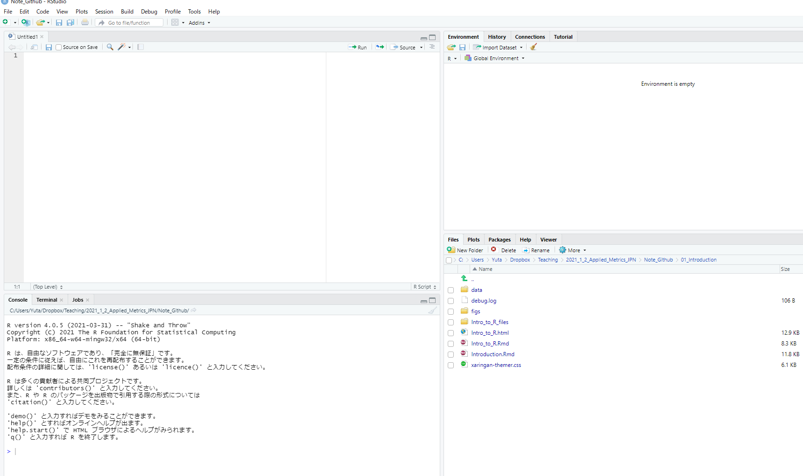

class: title-slide-section, center, middle

# Introduction of `R` and `Rstudio`


---

## Why do we learn computation ?

1. Conduct statistical and empirical analysis using your own data set
    1. Construct the data set
    2. Describe the data
    3. Run regression or estimate an economic object
    4. Make tables and figures that show the results of your analysis.
    

2. Confirm implications from econometric theory through numerical simulations.
    - Ex. Asymptotic theory considers the case when the sample size is large enough (i.e., $N \rightarrow \infty$) 
        - Law of large numbers, central limit theorem
        - How well is the asymptotic approximation? 
    - So called **Monte Carlo simulations**

---

## Why do we use R? 

- Many alternatives: Stata, Matlab, Python, etc...
- It is up to you (I am still using Stata and Matlab in some projects.) 

1. It is **free!!**
    - Stata is expensive.
    - Campus-wide licence for Matlab is available.
2. Good balance of flexibility and easy-to-use for econometrics
    - Stata is easy to use for econometric analysis, but hard to write your own program.
    - Matlab is the opposite. 
    - You can do (almost) everything in R, including data construction, regression analysis, machine learning, structural estimation
3. Many users
    - Can find online resources both in Japanese and English
    - Many packages developed by users: `tidyverse`, machine learning tools, etc
    

---

## How to learn `R` (or programming language in general)?

- (My opinion) **Learning by doing** is the best way to learn programming language. 

- I will show various code examples, but this is **NOT the class of R language**.


- If you face a trouble in programming, 
    1. Google it! Use the error message as search words.
    2. Post a question in the online forum on Moodle.
    3. Ask TA or me during the office hour. 

---

## Useful Online Resource for R programming

- Wickham and Grolemund "R for Data Science" https://r4ds.had.co.nz/ 
    - Developer of `tidyverse`
    - English version free. [Japanese translation](https://www.amazon.co.jp/dp/487311814X/) also available.


- Datacamp https://www.datacamp.com/


- 宋財泫・矢内勇生「私たちのR: ベストプラクティスの探究」https://www.jaysong.net/RBook/
    - Strongly recommended (if you read Japanese)

---

## Contents Today

- Getting Started
  - Install
  - script
  - package
  
  
- Elementary calculation (R as a calculator)


- Basic programmming
  - Variable (変数)
  - Workflow: if/else, for loop
  - Define own function (関数)
<!-- - Dataframe -->
<!-- - Input and output -->
<!--     - Working directory -->
<!--     - Importing and Exporting files -->


---
class: title-slide-section, center, middle
# Getting Started 

---

## Install R and RStudio

- What is `R` and `RStudio`
  - `R` is a programming language 
  - `RStudio` is **integrated development environment (IDE, 統合開発環境)** that contains useful tools for programming.


- Install R and RStudio 
    1. R: https://www.r-project.org/
    2. RStudio:  https://www.rstudio.com/


- For details of installation, see [here (in Japanese)](https://www.jaysong.net/RBook/installation.html#installation) 

---

## Cheatsheets

- The RStudio team has developed a number of ["cheatsheets"](https://www.rstudio.com/resources/cheatsheets/).


- Particularly useful ones for this course
    - [RStudio IDE Cheatsheet (JPN)](https://github.com/rstudio/cheatsheets/raw/master/translations/japanese/rstudio-IDE-cheatsheet_ja.pdf)
    - [Base R (JPN)](https://github.com/rstudio/cheatsheets/raw/master/translations/japanese/r-cheat-sheet-ja.pdf)
    - [Data Wrangling (JPN)](https://github.com/rstudio/cheatsheets/raw/master/translations/japanese/data-wrangling-japanese.pdf)
 
    
- Other useful cheatsheets
    - [estimatr](https://github.com/rstudio/cheatsheets/raw/master/estimatr.pdf): regression
    - [stata2r](http://github.com/rstudio/cheatsheets/raw/master/stata2r.pdf): translations from Stata to R
    - [R Markdown](https://github.com/rstudio/cheatsheets/raw/master/rmarkdown-2.0.pdf)


---

## Quick Tour of Rstudio 

<div class="center"></div>


---

## Four panels 

1. Source: Write your own code here. 

2. Console: Evaluate your code

3. Environment/History: 

4. Files/Plots/Packages/Help:

---

## Source (ソース) Panel 

- You can write your own code. 

- You should always save your code in script file (`.R` file).

- Click `Run` command to run your entire code.

- Alternatively type `SHIFT + ENTER` (in Windows) to run the selected line(s).

---

## Console (コンソール) Panel 

- The place where your code is evaluated 

- After clicking `Run` in the source panel, your code is evaluated.

- You can directly type your code here.

---

## Packages (パッケージ)

- One of the main strengths of `R` as an open-source project is its package system. 
  - A package contains useful functions developed by users.


- To install a package, use the `install.packages()` function. 
    - Think of this as buying a recipe book from the store, bringing it home, and putting it on your shelf.


- If you want to use a package, use `library()` function after installation.

---

## Example

- Example `ggplot2` package for visualization. But, **do not install it now!**

- You can install `ggplot2` by 

```{r, eval = FALSE}
install.packages("ggplot2")
```

- Once a package is installed, you must load it by `library()` function before you use it. 
    - Think of this as taking the book off of the shelf and opening it up to read.

```{r, eval = FALSE, warning = FALSE}
library("ggplot2")
```

- Once you close `R`, all the packages are closed.  
- The next time you open `R`, you do not have to install the package again, but you do have to load any packages you intend to use by `library()`.

---

## `tidyverse`

- `tidyverse` is a set of packages mainly developed by Hadley Wickams.
  - `dplyr`, `readr`, `ggplot2`, `readr`, `stringr`, and more!
  

- `tidyverse` is a de facto standard for data analysis.


- You must install `tidyverse` for this course. (Installation takes a time.) 

```{r, eval = FALSE, warning = FALSE}
install.packages("tidyverse")
```


---
class: title-slide-section, center, middle
# Basic Arithmetics (演算)

---


## Basic Calculations

To get started, we'll use `R` like a simple calculator.

**Addition, Subtraction, Multiplication and Division**

| Math          | `R`     | Result    |
|---------------|---------|-----------|
| $3 + 2$       | `3 + 2` | `r 3 + 2` |
| $3 - 2$       | `3 - 2` | `r 3 - 2` |
| $3 \cdot2$    | `3 * 2` | `r 3 * 2` |
| $3 / 2$       | `3 / 2` | `r 3 / 2` |


```{r}
1 + 3
```


---


## Exponents (累乗)

| Math         | `R`             | Result            |
|--------------|-----------------|-------------------|
| $3^2$        | `3 ^ 2`         | `r 3 ^ 2`         |
| $2^{(-3)}$   | `2 ^ (-3)`      | `r 2 ^ (-3)`      |
| $100^{1/2}$  | `100 ^ (1 / 2)` | `r 100 ^ (1 / 2)` |
| $\sqrt{100}$ | `sqrt(100)`     | `r sqrt(100)`     |

---

## Mathematical Constants 

| Math         | `R`             | Result            |
|--------------|-----------------|-------------------|
| $\pi$        | `pi`            | `r pi`            |
| $e$          | `exp(1)`        | `r exp(1)`        |

---

**Logarithms (対数)**

- Note that we will use $\ln$ and $\log$ interchangeably to mean the natural logarithm. 
- There is no `ln()` in `R`, instead it uses `log()` to mean the natural logarithm.

| Math              | `R`                 | Result                |
|-------------------|---------------------|-----------------------|
| $\log(e)$         | `log(exp(1))`       | `r log(exp(1))`       |
| $\log_{10}(1000)$ | `log10(1000)`       | `r log10(1000)`       |
| $\log_{2}(8)$     | `log2(8)`           | `r log2(8)`           |
| $\log_{4}(16)$    | `log(16, base = 4)` | `r log(16, base = 4)` |

---

**Trigonometry (三角関数)**

| Math            | `R`           | Result          |
|-----------------|---------------|-----------------|
| $\sin(\pi / 2)$ | `sin(pi / 2)` | `r sin(pi / 2)` |
| $\cos(0)$       | `cos(0)`      | `r cos(0)`      |

---

## Getting Help

- In using `R` as a calculator, we have seen a number of functions: `sqrt()`, `exp()`, `log()` and `sin()`. 
- To get documentation about a function in `R`, simply put a question mark in front of the function name and RStudio will display the documentation, for example: 

```{r, eval = FALSE}
?log
?sin
?paste
?lm
```

---

# Programming Basics

---

## Overview

- Give a quick overview on the following concepts through an exercise
  - Working directory (ワーキングディレクトリ)
  - Variable (変数)
  - Workflow: if/else, for loop
  - Define a function (関数)
  
---

## Exercise: Statistical Estimation of Population Mean

- In statistics and econometrics, we are interested in a certain feature of **population (母集団)** such as **population mean (母平均)**


- To estimate it, we rely on **statistical estimation (統計的推定)**
  - Draw **a random sample** with $N$ observations from population, giving you **dataset** $\{ Y_1, Y_2, \cdots, Y_N \}$.
  - Calculate **sample mean (標本平均)** by 
  $$ 
  \bar{Y} = \frac{1}{n} \sum_{i=1}^n Y_i, 
  $$
  
  
- Why is $\bar{Y}$ a good estimator (推定量) for population mean?

---

## Examine the properties of sample mean by simulation

- We examine the properties of sample mean through numerical simulations.


- Idea: 
  - Prepare a population distribution of some variable.
  - Draw a random sample from the population and calculate the corresponding sample mean.
  - Repeating this procedure, we can construct many samples means for each sample.
  


---

## Step 1 (/4): load packages

- If you have not installed it yet, please do so by `install.packages("")`.

```{r, message = FALSE}
library("tidyverse")
```


---

## Step 2 (/4): Prepare a population

- We use income and age data from PUMS of U.S. Cencus 2000
  - PUMS: Public Use Microdata Sample 
  - Download `data_pums_2000.csv` and put it into your **working directory**   
  
- Before loading PUMS data into R, I introduce two basic concepts
  - **Working directory**
  - **Variable**

---

## Programming Basics 1: Working Directory

- **Working directory (作業ディレクトリ)** is a directory to which the system is currently refer to. 

- You can check your current working directory by
```{r}
getwd()
```
- If you want to change your working directory, type 
```{r, eval = FALSE}
setwd("YOUR Directory Path")
```

---

## Programming Basics 2: Variable

- **Variable (変数)** is a storage with name where you can keep data.
- You can define variable like
```{r}
X <- 10
```
- You can refer the variable `X` later as follows
```{r}
X
2*X
```

---

- The variable can contain many different types of data
  - Scalar (数字)
  - Vector (ベクトル)
  - Matrix (行列)
  - List (リスト)
  - Data Frame (データフレーム)

---


## Load PUMS data

- Use `read_csv` function in `readr` package (included in `tidyverse`)
```{r, message = FALSE}
pums2000 <- read_csv("data/data_pums_2000.csv") 
```


- Note 1: 
  - The argument (引数) in `read_csv()` refers the path of the file. 
  - R tries to find this file in the `data` folder in the **working directory**.
  - This way of referring the file is called **relative path (相対パス)**.
  - You can specify the absolute path (絶対パス) of the file that includes the directory. However, I strongly recommend you to use relative path.


- Note 2: 
  - The variable `pums2000` contains data from `data_pums_2000.csv` file.
  - The type of this variable is **dataframe**.
  
  
---

## Define population

- We treat this data as **population**

```{r}
# pop_inc is a vector
pop <- as.vector(pums2000$INCTOT)
```


- Population mean and standard deviation 

```{r}
# Average income in population
pop_mean = mean(pop)
pop_mean

# Standard deviation of income in population
pop_sd   = sd(pop)
pop_sd
```


---

## Income distribution in population (Unit in USD)

- Use `ggplot2`.


```{r}
fig <- ggplot2::qplot(pop, geom = "density", 
      xlab = "Income",
      ylab = "Density")

```

- Notes
  - `qplot` is a function in `ggplot2` package. `PACKAGENAME::FUNCTIONNAME` is a way to call function.
  - The variable `fig` contains a graph. 

---

```{r, out.width= '50%'}
plot(fig)
```

---

- The distribution has a long tail.
- Let's plot the distribution in *log* scale

```{r}
# `log` option specifies which axis is represented in log scale.
fig2 <- qplot(pop, geom = "density", 
      xlab = "Income",
      ylab = "Density",
      log = "x")

```


---

```{r, out.width= "50%"}
plot(fig2)
```

  
---
  
## Step 3 (/4): Draw a random sample and calculate sample mean

- Let's investigate how close the sample mean constructed from the random sample is to the true population mean. 

- We draw a random sample with $N$ observations from this population and calculate $\bar{Y}$ for each sample.

- We repeat this procedure 200 times. You now have 2000 sample means.


---

## How to draw a random sample

- Before start: You must set the **seed** for the **random number (乱数)**. This is to maintain the reproducibility (再現性) of the results.
```{r}
set.seed(12345)
```

- draw random sample of 100 observations from the variable pop
```{r}
test <- sample(x = pop, size = 100)
```
  
- The variable `test` contains 100 observations randomly drawn from the population. Sample mean is given by 
```{r}
mean(test)
```

---

## Programming basics 3: for loop

- What if you want to repeat the same procedure many time? Use `for` loop!!

- Before use forloop:
```{r}
Nrep = 200
result1 <- numeric(Nrep)
```
- `result1` is a vector with a length of 200. Its elements are all zero.

---

- Here is a main part

```{r}
for (i in 1:Nrep ){
  test <- sample(x = pop, size = 100)
  result1[i] <- mean(test)
}
```

- `result1` contains 200 sample means calculated from 200 random samples.

- Programming tips: You should first prepare a vector to which you store the result in loop. Otherwise, the computation will be very slow.
  
---

## Step 4 (/4): Distribution of sample means

- How does the distribution of sample means look like?

```{r, out.width= "50%"}
fig3 <- qplot(result1, geom = "density", 
      xlab = "Sample Mean",
      ylab = "Density") +
  geom_vline(xintercept = pop_mean, color = "red")
```

---

```{r, out.width= "50%"}
plot(fig3)
```

---

## Programming Basics 3: Function

- What if the sample size gets larger? Say, $N = 100, 200, 400$?


- To do this, we construct a **function (関数)**.


- To define a function, need to specify
  1. Name of your own function
  2. Argument (引数)
  3. Code 
  4. Output (出力)

---

## Define a function 

- The function `f_samplemean`

```{r}
f_samplemean <- function(pop, size){

  Nrep = 200
  result <- numeric(Nrep)

  for (i in 1:Nrep ){
    test <- sample(x = pop, size = size)
    result[i] <- mean(test)
  }
  
  return(result)
}
```

---

## Details

- Argument (or input):
  - `pop`: variable that contains population
  - `size`: sample size or number of observations
- Code: Draw 200 random samples with `size` observations and calculate sample mean
- Output: `result` that contains 200 sample means.

---

## Step 3 and 4 continued: 

- Use the defined function to construct samples means with different sample size
```{r}
result1 <- f_samplemean(pop, size = 100)
result2 <- f_samplemean(pop, size = 400)
result3 <- f_samplemean(pop, size = 800)
```

- Prepare a dataframe for visualization
```{r}
result_data <- tibble(  Ybar100 = result1, 
                        Ybar400 = result2, 
                        Ybar800 = result3)

```

---

## Compare the distributions


```{r}

# Use pivot_longer to change the format of result_data
data_for_plot <- pivot_longer(data = result_data, cols = everything() )

# Use "ggplot2" to create the figure.
fig <- 
  ggplot(data = data_for_plot) +
  xlab("Sample mean") + 
  geom_line(aes(x = value, colour = name ),   stat = "density" ) + 
  geom_vline(xintercept=pop_mean ,colour="black")

```

---

```{r}
plot(fig)
```

---

## Question

- Discuss the simulation results in terms of **unbiasdness (不偏性)** and **consistency (一致性)**.

