class: title-slide-section, center, middle
name: logistics

# Introduction

---

# Today's Overview

- Application of randomized controlled trial.

- Reference: Ito, Ida, and Tanaka (2018) ["Moral Suasion and Economic Incentives: Field Experimental Evidence from Energy Demand"](https://www.aeaweb.org/articles?id=10.1257/pol.20160093) *American Economic Journal: Economic Policy*

- This paper conducts a field experiment in Japan to estimate the impact of moral suasion (道徳的訴え) and electricity price on energy demand.

---
class: title-slide-section, center, middle
name: logistics

# Research question

---
## Motivation: Moral suasion or economic incentive?

- Use **moral suasion(道徳的訴え)** and **economic incentives(経済インセンティブ)** to influence intrinsic and extrinsic motivation 
    - governments: energy conservation, smoking cessation, tax compliance, etc.
    - firms and NPOs: academic refereeing, blood donations, exercise, etc.
  
    
- Question: Can appealing to intrinsic and extrinsic motivations can generate persistent effects on economic activities?

---
## Moral suasion or economic incentive in electricity demand

- A field experiment in the context of **electricity demand**. 

- Two types of treatment
  - moral suasion by **voluntary energy conservation**
  - economic incentive by **charging high marginal prices for electricity**.

- Use household-level electricity consumption data of 30-minute intervals.

- Examine **how these treatments affect electricity usage in peak-demand hours** 

---
## Mechanisms 

- **Habituation**: 
  - Repeated presentation of a stimulus might cause a decrease in reaction to the stimulus. 
  - Ex: Animals strongly react to a stimulus when it is presented for the first time, but their responses often gradually wane when the same intervention is repeated over time. 
  

- **Dishabituation**: 
  - Declined responses can be restored to an original level either by providing a new type of treatment, a stronger or weaker intensity of the same treatment, or the same treatment with a sufficient time interval between interventions. 

- **Spillover effect**: Treatment effects might spillover nontreatment periods. 

- **Habit formation**: treatment effects might continue to exist after the final intervention but decay over time.

---

class: title-slide-section, center, middle
name: logistics

# Experimental design

---
## Field experiment

- Period: The summer of 2012 and the winter of 2013

- Place: The Keihanna area of Kyoto prefecture in Japan

- Participants: 691 households.
  - Every household received "smart meter" and the generous participation reward (¥24,000).
  - Smart meter can collect household-level electricity usage at 30-minute intervals.

---
## In-home displays: real-time usage and price

.middle[
.center[
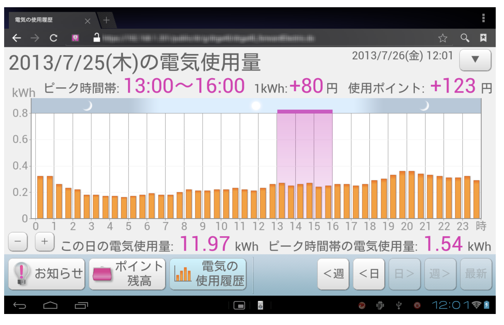
]
]

---
## Discussin on External Validity

- RCT for self-selected participants
  - OK for internal validity
  - need to carefully discuss the **external validity** of the experiment
  
  
- Conduct a survey for a random sample of 717 households in the experiment area (next page)

---

## Balance check and External Validity

.middle[
.center[
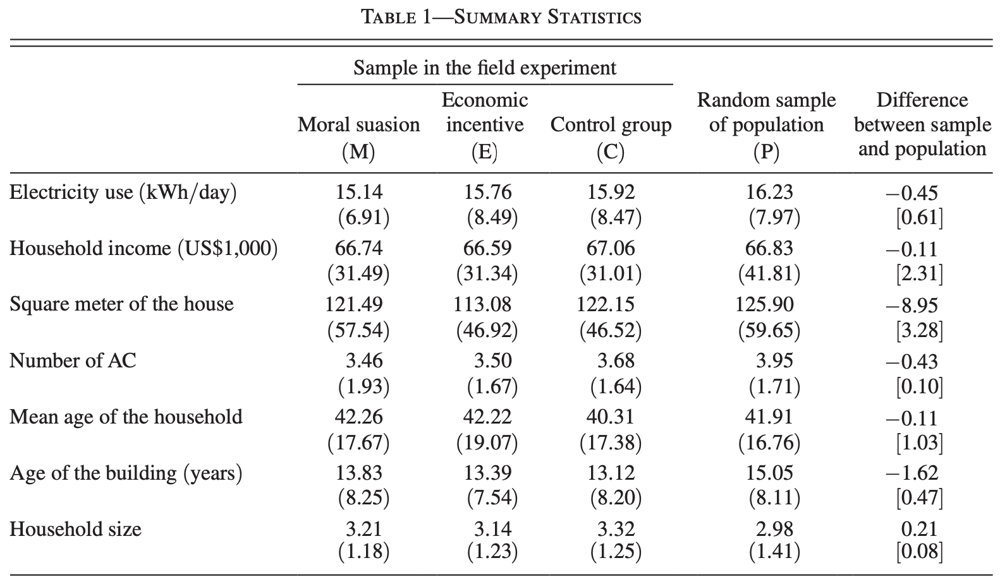
]
]

---
## Control and Treatment group

- **Control Group**: The 153 customers in this group received no other treatment.

- **Moral Suasion Group**: The 154 customers in this group received “moral suasion for energy conservation.”

- **Economic Incentive Group**: The 384 customers in this group received “economic incentives for energy conservation.” 

---
## Moral suasion treatment

- **Treatment hours** were predetermined 
  — 1 pm to 4 pm for the summer 
  - 6 pm to 9 pm for the winter
  
  
- A **treatment day**: a weekday in which 
  - the day-ahead maximum temperature forecast exceeded 31°C (88°F) for the summer and
  - lower than 14°C (57°F) for the winter.

---
## Example treatment date, August 21: 

- On August 20, the forecast maximum temperature for August 21 was reported to be above 31°C (88°F). 

- Then, they delivered **notifications** to customers at 4 pm on August 20 by a text message to their in-home displays, cell phones, and computers. They can view the message between 4 pm on August 20 and 4 pm on August 21. 

- The text message sent to the moral suasion group was **“Notice of Demand Response: In the following critical peak-demand hours, please reduce your electricity usage: 1 pm– 4 pm on Tuesday, August 21.”** 

---
## Economic incentive treatment

- Treatment hours and days are same as the moral suasion treatment.

- Baseline price: 25 yen/kWh

- On treatment days, 65, 85, or 105 yen/kWh.

- For example, at 4 pm on August 20, the economic incentive group received this message, **“Notice of Demand Response: In the following critical peak-demand hours, you will be charged a very high electricity price, so please reduce your electricity usage: 1 pm– 4 pm on Tuesday, August 21. The price will be 85 yen (+ 60 yen) per kWh.”**

---
## Economic incentive treatment in detail

- For a given treatment day, all customers had the same critical peak price.

- They randomized the prices across the treatment days. 
    - They divided the treatment days into **treatment cycles**, which consisted of three treatment days. 
    - And each cycle included a treatment day with 65, 85, and 105 yen/kWh, in which the order of the three prices in each cycle is randomized. 

- Example of two treatment cycles around August 21: 
  - The day-ahead forecasts for the maximum temperatures exceeded the threshold for August 17, 21, 22, 28, 29, and 31. 
  - August 17, 21, and 22 as a cycle and August 28, 29, and 31 as another cycle are grouped. 
  - They randomized the three critical peak prices in each cycle. As a result, customers had prices of 65, 105, 85, 85, 65, and 105 yen for these six treatment days.

---

class: title-slide-section, center, middle
name: logistics

# Empirical analysis and Implications

---
## Result - Overall effect

.middle[
.center[
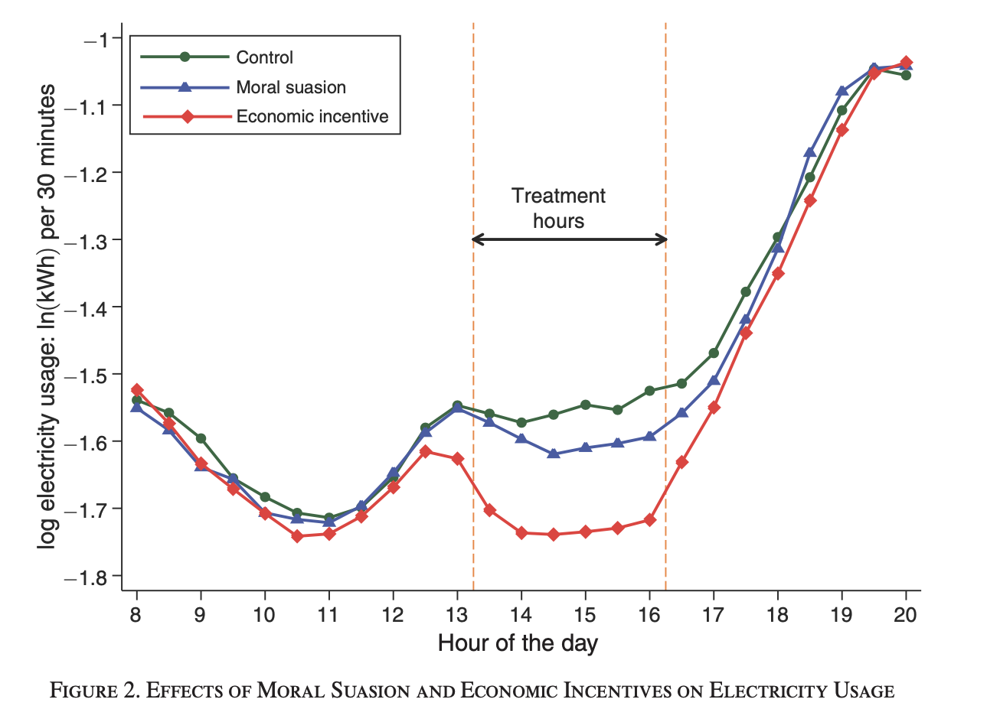
]
]

---
## Regression Model
- Regression: 
$$\ln x_{it} = \beta M_{it} + \gamma E_{it} + \theta_i +\lambda_t + \eta_{it}$$
    - $\ln x_{it}$: the natural log of electricity usage for household i in a 30-minute interval t 
    - $M_{it}$: 1 if the moral suasion group and receives a treatment in t
    - $E_{it}$: 1 if household i is in the economic incentive group and receives a treatment in t
    - $\theta_i$: household fixed effects 
    - $\lambda_t$: time fixed effect
    
    
- Sample period: the pre-experiment days and treatment days 
  - only treatment hours (1~4 pm for the summer and 6~9 pm for the winter)

---

.middle[
.center[
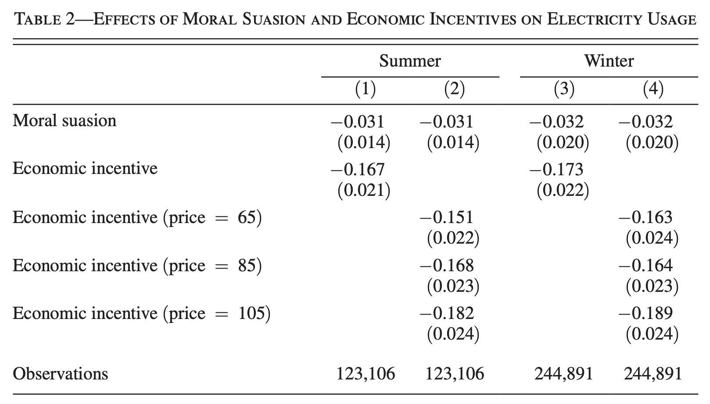
]
]

---
## Summary of Results

- Moral suasion caused a reduction in peak-hour electricity usage by 
  - 0.031 log points (3.1% $= exp(-0.031)-1$ ) for the summer treatment days 
  - 0.032 log points (3.2%) for the winter treatment days.

- Economic incentive caused a reduction in peak-hour electricity usage by
  - 0.167 log points (15.4%) for the summer and
  - 0.173 log points (15.9%) for the winter.

- The difference of treatment effects are statistically different at 1% significance level.

---
## Response to different marginal prices

- Consumer reduced usage more in response to higher marginal prices. 
  - a monotonic relationship between price and response.

- **Price does matter!!**

- An important implication for energy policy 
  - Regulators and utility companies often believe that electricity consumers do not respond to electricity prices at all,
  - and therefore, a price-based policy is not a practical solution to mitigate problems on the retail side of electricity markets.
  
  

---
## Result - Habituation and Dishabituation

- Treatment cycles
  - 15 summer treatment days are divided into five cycles, 
  - 21 winter treatment days are divided into seven cycles

- Regression: 
$$ln x_{it} = \sum_{c\in C}(\beta_c M_{itc} + \gamma_c E_{itc}) + \theta_i +\lambda_t + \eta_{it}$$
    - where $\beta_c$ and $\gamma_c$ are the effects of moral suasion and economic incentives for treatment cycle c.

---

.middle[
.center[
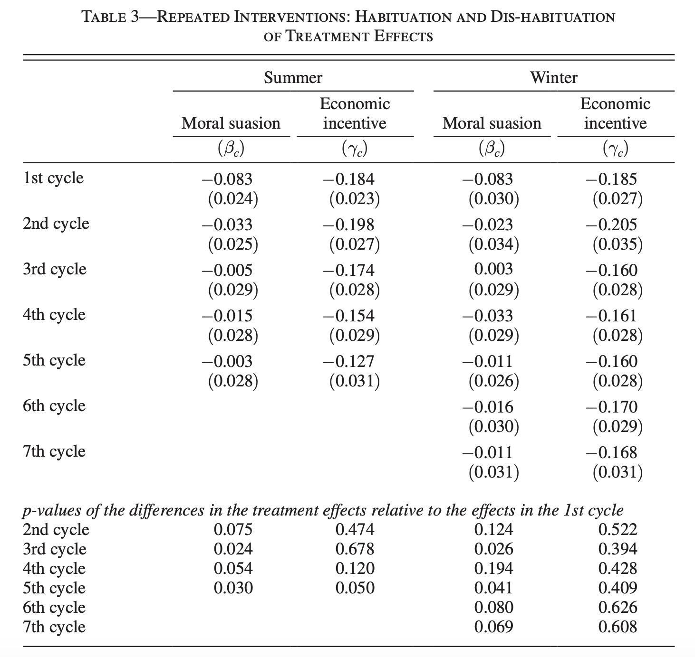
]
]

---

.middle[
.center[
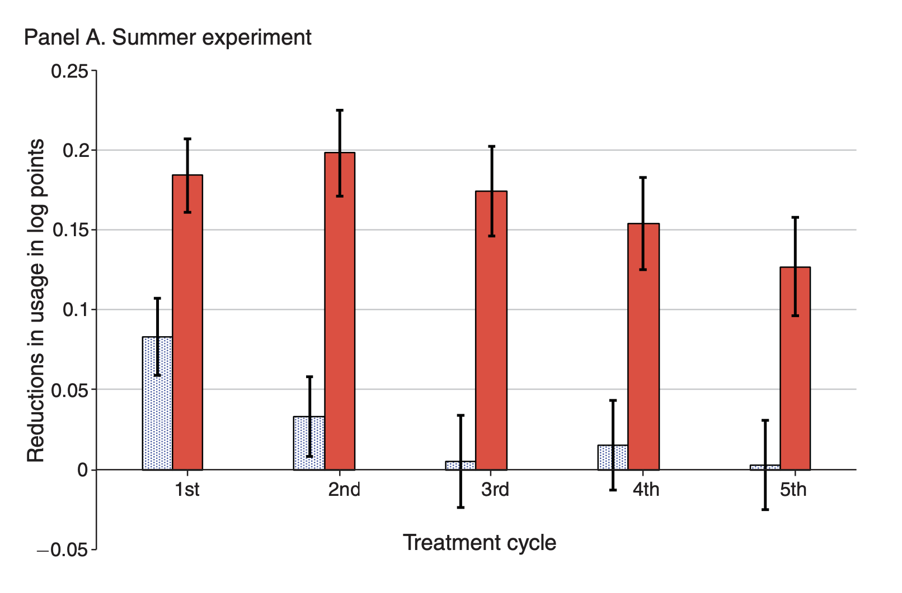
]
]

---

.middle[
.center[
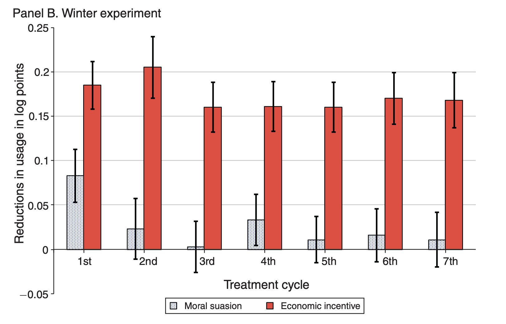
]
]

---
## Summary

- For moral suasion group, habituation and dishabituation are significant.

- For economic incentive group, habituation is smaller.

- The average price elasticities and standard errors are 
  - −0.136 (0.017) for the summer and −0.141 (0.018) for the winter, 
  - Similar to those found in previous studies. 
  - This provides suggestive evidence of external validity of the experimental sample.

---
## Four key implications

- Both moral suasion and economic incentives are likely to produce sizable policy impacts in the short run.

- However, the effect of moral suasion is likely to habituate fast when the intervention is repeated over time. 

- The habituated response to moral suasion can recover back to an original level by providing a sufficient time interval between interventions. 

- The effect of economic incentives is much less likely to habituate than moral suasion is.

---
## Result - Spillover effect

.middle[
.center[
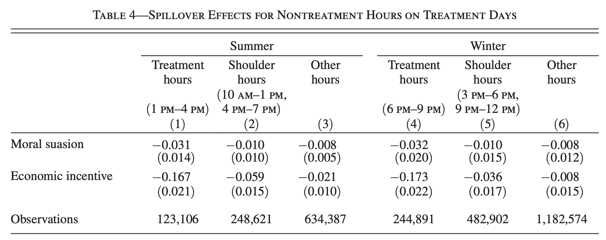
]
]

- Customers in the economic incentive group reduce usage during the nontreatment hours.
- No such spillover effects are found for the moral suasion group.
- These results imply that the economic incentives in our experiment motivated customers to lower their usage in both the nontreatment hours and the treatment hours.
---
## Result - Habit formation

- Collecte data for the post-intervention period (i.e., no treatment)

.middle[
.center[
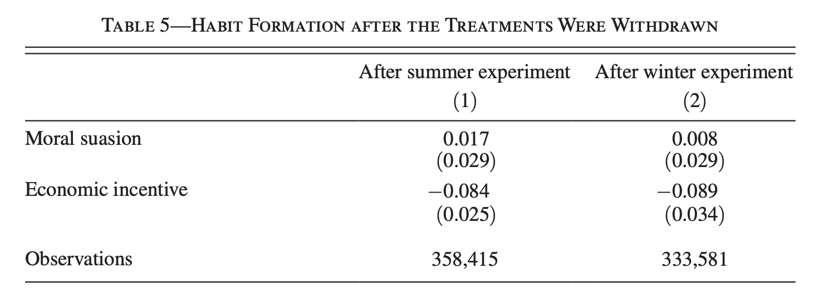
]
]

- No habit formation by the moral suasion group  
- Habit formation by the economic incentive group

---
## Mechanisms behind the Treatment Effects

- Moral suasion was effective only for the first few treatment days and habituated quickly over repeated interventions. 

- By contrast, economic incentives produced strong persistent effects on energy conservation.

- Two potential mechanisms
    1. the treatments might have induced investment in physical capital stock (new and efficient appliances)
    2. the treatments might have induced new utilization habits for daily electricity use.

---
## Result - Energy Investment

- Whether households purchased energy-efficient appliances since the beggining of the experiment.

.middle[
.center[
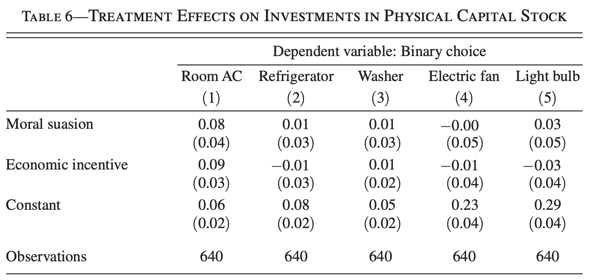
]
]

- Similar increases in purchasing energy-efficient air conditioners across two treatment groups.

---
## Result - New Habit

- Two questions after the epxeriment 
    1. Their efforts toward adopting an energy-efficient lifestyle (Column 1).
    2. Whether they were using each electric appliance in an energy-efficient way (Other columns).

.middle[
.center[
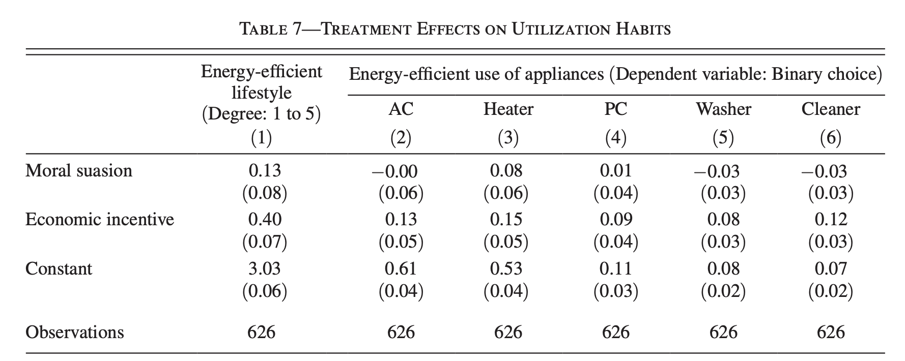
]
]

