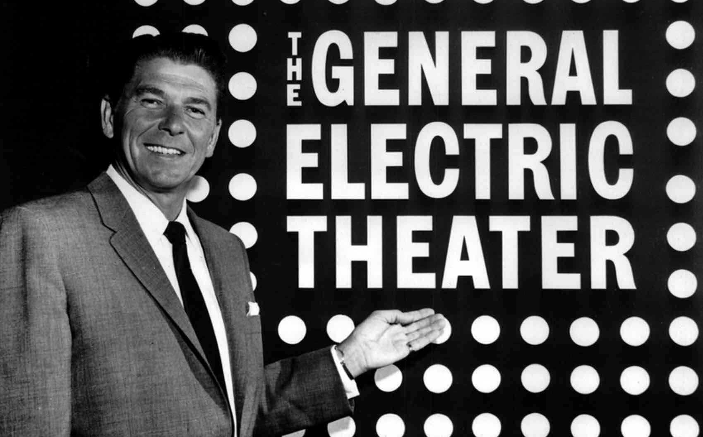
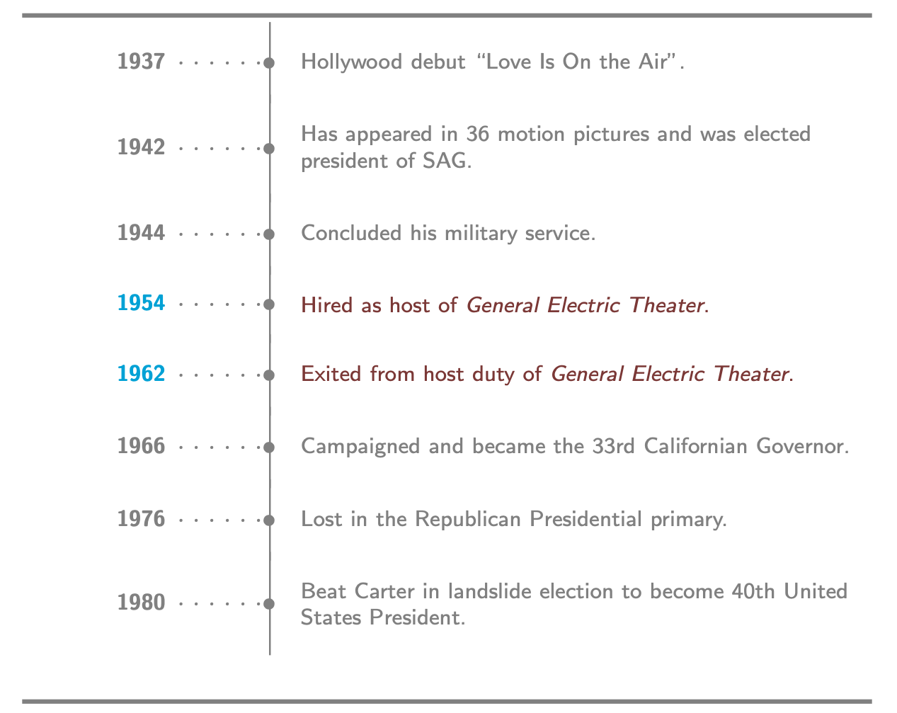
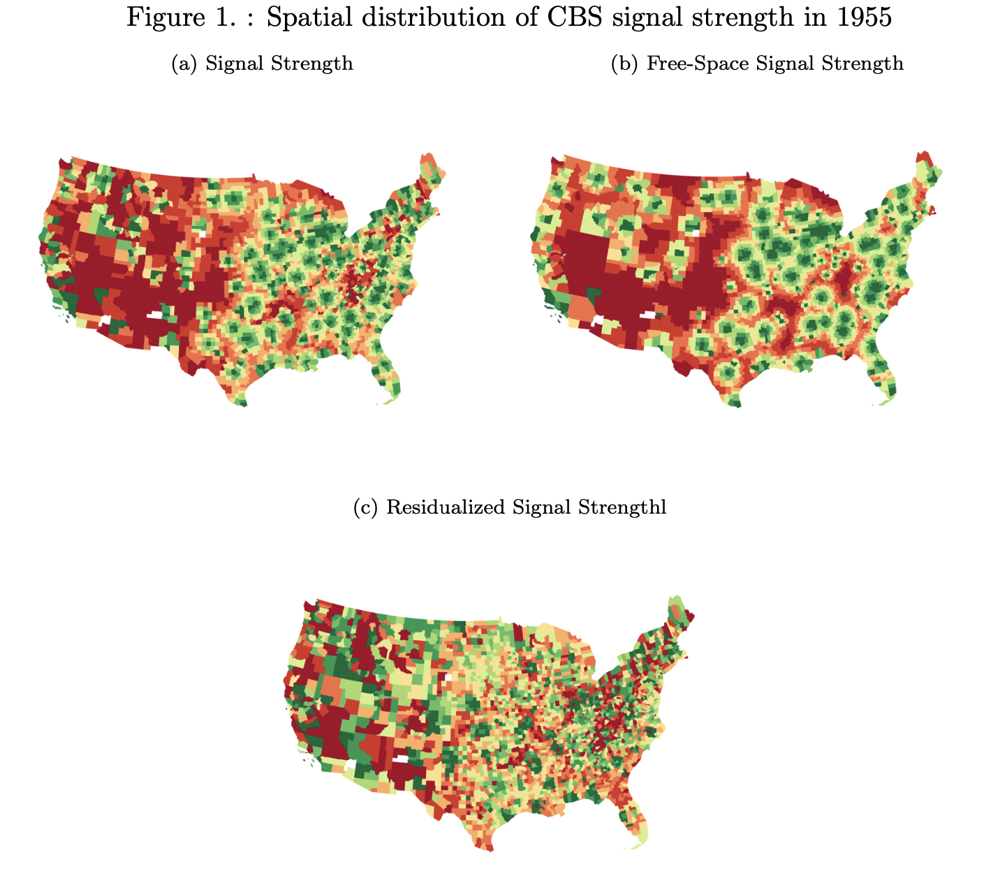
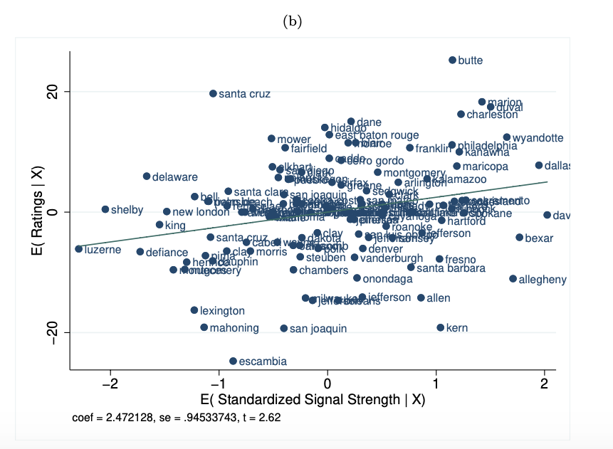
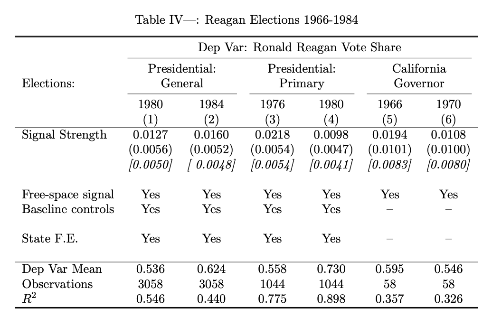
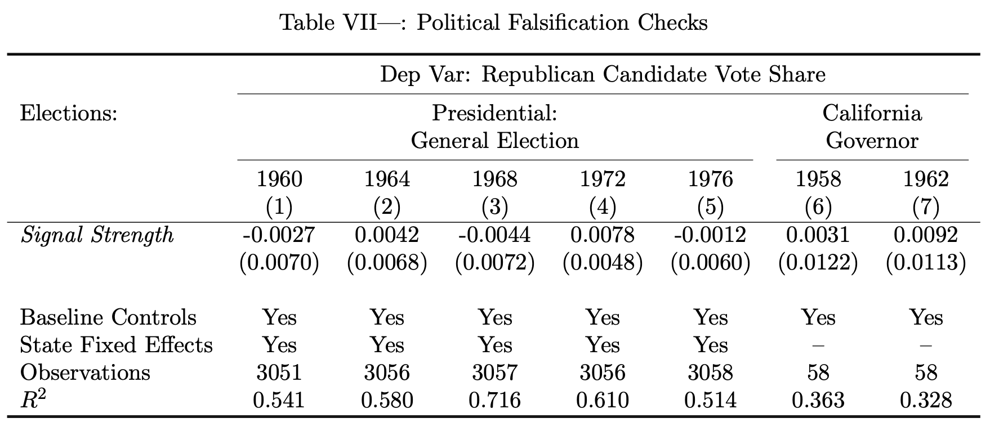
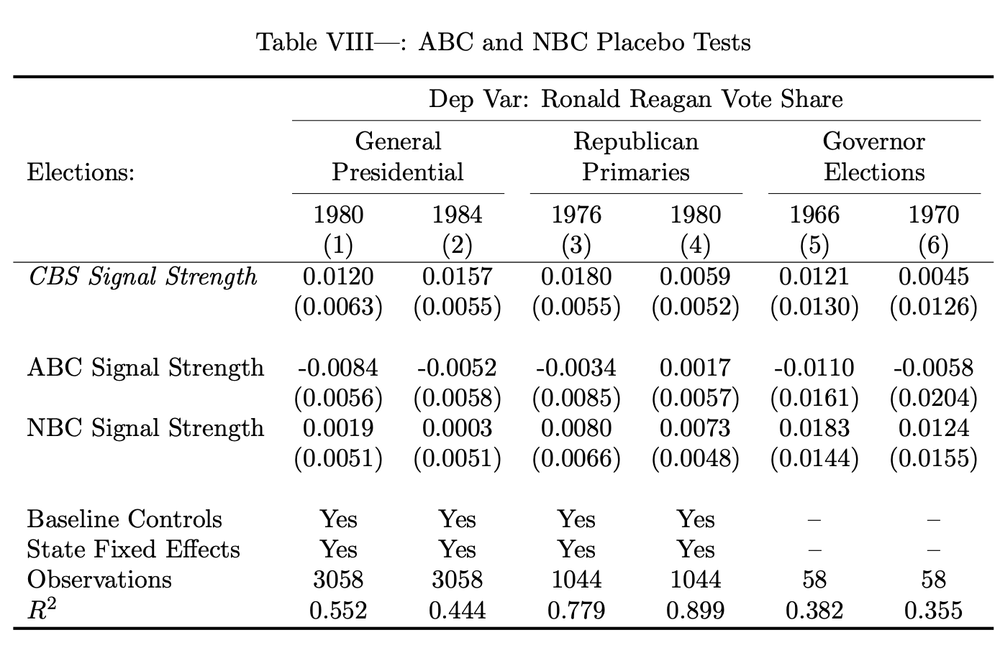

class: title-slide-section, center, middle

## Introduction

---

## Introduction

- Heyu Xiong "The Political Premium of Television Celebrity" AEJ-Applied (forthcoming)

- Take-away
  - Research Design only with crosssectional data.
  - Various falsification tests as a robustness check

---
class: title-slide-section, center, middle
name: logistics

# Motivation and Research question

---
## Effect of TV exposure on political supoort?

- **What influences voters** is of long-standing interest to social scientists. It is well established that political communication and media plays a prominent role in shaping political attitude and behavior.

- Political campaigns spend millions of dollars designing content for the express purpose of political persuasion.

- However, **whether candidate exposure through non-political content, such as entertainment programming, can affect voting decisions** is largely unexplored. 

---
## Superficial evidence 

.pull-left2[
- Donald Trump was a host of *The Apprentice*, a famous reality TV serias run on NBC. 

- A survey gives the evidence that political support for Trump’s candidacy differed markedly between *The Apprentice* viewers and non-viewers. Viewers held more favorable opinions of him and discounted negative information.
]

.pull-right2[
.middle[
.center[

]
]
]

---
## Difficulty of identification

- However, these convincing correlations don't exclude the possibility that these relationships are driven by **confounders**, such as underlying political preference. That is, if media habits is correlated with it, the association between watching the TV show and the support for him does not mean causality.

- **This paper addresses these empirical difficulties in a historical setting by exploiting the television broadcast infrastructure as a source of identifying variation.**

---
## Ronald Reagan hosting General Electric Theater

- Specifically, the author investigate whether **Ronald Reagan**’s host of a popular 1950s television program, **General Electric Theater** (G.E. *Theater*) affected electoral support for him.

.middle[
.center[

]
]

---
## Ronald Reagan hosting General Electric Theater

- The research design utilizes differences in the coverage of the program, generated by the locations and technological limitations of the broadcast stations in 1954.

- His research question is, therefore, **whether spatial variation in household’s access to G.E. Theater predicts the variation in local political support for Reagan during his entries into national and state politics.**

---

class: title-slide-section, center, middle
name: logistics

# Background and Data

---
## Ronald Reagan and General Electric *Theater*

- Never a top billing star, Reagan nevertheless compiled an extensive filmography of 52 movies from 1937 to 1950. In 1952, Reagan transitioned to television; hosting G.E. *Theater*. During Reagan’s tenure as the host of G.E. *Theater* from 1954 to 1962, he became a household name.

- G.E. *Theater* was a half-hour dramatic anthology series, which was apolitical, aired by CBS on Sunday evenings from 1953 to 1962. The program was enormously successful and the third-most-popular show at its peak. 

- Reagan would appear each week at the start of the episode to introduce the theme and content.

---
## Chronology of Reagan’s career

.middle[
.center[

]
]

---
## History of Television Broadcasting in the U.S.

- Television was first licensed for commercial broadcasting in the United States on July 1, 1941.

- Compared to today, available television content varied greatly across locations. On the eve of G.E. *Theater*’s debut, at most **less than 50% of all U.S. counties received a television signal from CBS**.

- The quality of the signal received was governed by not only distance between transmitter and receiver but transmission power, broadcast frequency, height of towers, and, importantly, the topographical features of the terrain.

- **The paper uses the signal strength as a proxy of a household’s viewership of G.E. Theater**.
---
## Television Signal Data

- From the precise data the broadcast towers (determinants of signal strength as mentioned above), the **CBS signal strength** is computed by using professional engineer-developed software program based on ITM algorithm. **The algorithm combines the transmission specifications of broadcast towers with topographical information** to predict the signal strength from each transmitter to any given receiver location. 

- “Free-space” signal is the hypothetical television reception assuming the surface of the Earth is completely flat. The **hypothetical signal strength** is entirely determined by the proximity of a location to broadcast stations and encapsulates the endogenous component of actual signal strength.

- The **difference between the actual and hypothetical signal intensity** within relatively small areas will be driven by idiosyncratic terrain characteristics that are **plausibly exogenous** to other determinants of voting.

---
### Spatial distribution of CBS signal strength in 1955

.middle[
.center[

]
]

---
## Effect of signal strength on program viewership 

- **The crucial assumption is that the strength of CBS signal affects the viewership of G.E. Theater**, the latter of which is the latent variable of interest.

- He validates this assumption by regression of local television ratings on signal strength. The ratings are obtained from market reports conducting sampling researches among 130 distinct television markets.

- As magnitudes the  a one standard deviation increase in the signal strength is associated with a 2.47 percentage-point increase in the share of households that watch the program within the respective location.

- (In a full structural 2SLS model, this would be expressly developed in a first-stage regression. This approach is problematic due to the poor coverage and availability of the viewership data.)

---
### Relation between signal strength and ratings

.pull-left[
.middle[
.center[

]
]
]

.pull-right[
.middle[
.center[

]
]
]
---
class: title-slide-section, center, middle
name: logistics

# Empirical analysis

---
## Estimation of the effect of exposure to G.E. Theater on electoral outcomes

- He regresses Reagan’s vote shares on the simulated signal intensity (Signal) controlling for hypothetical signal intensity under the flat terrain hypothesis (SignalFree)

- The model is: $$y_{i s}^t=\beta Signal_i + \alpha SignalFree_i + \gamma {\bf X_i}+\sigma_s+\epsilon_i$$
    - $y_{i s}^t$ : the share of votes cast for Reagan in county i of state s in election t
    - $Signal_i$ : the ITM algorithm predicted signal strength
    - $SignalFree_i$ : the hypothetical signal strength assuming flat terrain
    - ${\bf X_i}$ : a vector of geographic and socio-economic controls,include county population, median household income, percentage of the population that is African-American, distance to the nearest CBS station, county
    - $\sigma_s$ : state fixed effects
    
---
## Identification strategy

- The coefficient of interest is $\beta$.

- To account for potential endogeneity in the location of the CBS stations, he controls for the hypothetical signal intensity in the absence of any geomorphological obstacles, $SignalFree$.

- Keeping $SignalFree$ constant, the $\beta$ is identified by the differences between the actual and hypothetical signal intensity within relatively small areas, which is driven by idiosyncratic terrain characteristics. 

- Importantly, the identification assumption requires only that conditional on $SignalFree_i$ and other controls, $Signal_i$ is unrelated to other determinants of Reagan support.

---
## Intuition

- The underlying intuition is that the **free-space signal strength accounts for the endogenous component of reception**. By controlling for the proximity to the nearest transmitting site, the remaining variation in reception comes from a household’s relative positioning with respect to geographic obstacles in a line of sight from the broadcast tower, e.g. whether one is located to the left or right of a mountain range. 

- This **residual variation is assumed to be plausibly exogenous and thereby orthogonal to voting behavior**.

---
class: title-slide-section, center, middle
name: logistics

# Results

---

.middle[
.center[

]
]

- All results are presented both with standard errors clustered at the state level and Conley standard errors with a cut-of window of 100 km. http://www.trfetzer.com/using-r-to-estimate-spatial-hac-errors-per-conley/

---

- In all national elections (Columns (1) \~ (4)), the coefficient is **positive and statistically significant**.

- During the 1980 general presidential election, a one standard deviation shift in Signal Strength leads to a 1.37 percentage point increase in Reagan’s vote share.

- Combining the first-stage regression, the **persuasion rate** in the 1980 general presidential election is **11.84%**, meaning that about 12% of the viewers who originally didn't support Reagan voted for him in the election by watching G.E. Theater. This value is comparable to those found in the existing literature.

- The impact in governor elections (Columns (5) and (6)) is less precisely estimated, likely due to the smaller sample size.

- These results are **robust to a number of alternative specifications**, including using population weights, controlling for the 1976 Republican presidential vote share to add controls for political and racial preferences, and excluding large metropolitan areas because rural areas are less subject to concerns about selection bias.

---

class: title-slide-section, center, middle
name: logistics

# Potential Sources of Bias and Placebo checks

---
## Placebo check 1 for elections Reagan didn't participate in

- **A key identification concern is that the strength of the CBS signal could be related to unobservables that correlate with Republican political support** and potentially bias the results. 

- The historical setting makes this relatively unlikely since CBS was not a partisan station in the 1950s and did not strategically locate their affiliates for political purposes.

- Nevertheless, to exclude this concern, he  replicates the same specification from Equation 1 for a set of comparable elections in which Reagan did not participate.

---

.middle[
.center[

]
]

- $Signal Strength$ coefficient are insignificant across all placebo elections and the point estimates are also consistently small in magnitude.

- Signal strength did not systematically correlate with political preference, which is the primary threat to identification.
---
## Placebo check 2 by NBC and ABC signal strength

- Another possible concern is the effect of **television consumption** more broadly.

- Perhaps Reagan was a better television candidate, that is, he performed better in televised debates or coverage of the election. Then **frequent television viewers could be more likely to vote for him regardless of whether they specifically watched G.E. Theater**.

- To address this possibility, he controls for the signal coverage of two other major broadcast networks operating at the time: NBC and ABC.

---

.middle[
.center[

]
]

- The ABC and NBC estimates are statistically insignificant and small in magnitude, while the coefficients on the CBS signal strength remain stable in magnitude.

- Given these falsification checks, the possibility is ruled out that unobserved political preferences or the simultaneous consumption of other television content explain the positive correlation between $Signal Strength$ and Reagan's $Vote Share$.

---
class: title-slide-section, center, middle
name: logistics

# Additional anlysis

---

- The celebrity exposure effect is consistent regarding **political donations**. The effect holds both at the extensive (the  donation probability) and intensive (the donation amount) margin.

- In terms of **heterogeneous effect**, the effect is larger in states having fewer restrictions on who can vote and where non-registered Republican voters can participate. 

- Besides, the effect is concentrated in historically Democratic counties. The impact of the program on voting appears to be due, at least in part, to the mobilization of voters who were not traditionally Republican. 

- When an analysis is restricted only for California, where Reagan had previously served as governor, the effect is insignificant. 

- The results indicate **the political premium of media exposure is partially tied to the voters’ lack of prior knowledge of the candidate. The effect declined as the candidate was regarded more as a politician**. This is consistent with rational learning.

---
## Mechanism exploration via individual-level data

- To examine the underlying mechanisms of the effect of celebrity exposure, the author uses individual-level data from the American National Election Studies.

- The individual-level data allows to use not only **locations** but also **birth cohorts** as a proxy of exposure to G.E. Theater. Because G.E. Theater was an evening program targeted toward adults, individuals who were born relatively later serve as a control group since they were children or unborn when it broadcast.

- The **county-cohort treatment** lets the empirical framework be analogous to a **difference-in-differences** strategy.

- The effect of celebrity exposure on political support could stem from the channel of **name recognition** alone or through persuasion based on other factors.

---
## Results

- The significance of name recognition depends on voter characteristics. For politically uninformed voters, G.E. *Theater* raised Reagan’s name recognition, whereas the effect is not significant for politically informed voters.

- For both groups, exposure to G.E. *Theater* led to a **more favorable evaluation** of Reagan. This suggests G.E. *Theater* had the capacity to induce a positive assessment of Reagan, independent of name recognition alone.

- Voters who were more likely to watch the program than not tend to attribute their decision to vote for Reagan to his **personal characteristics** not to his political ability, or standing within the party. 

