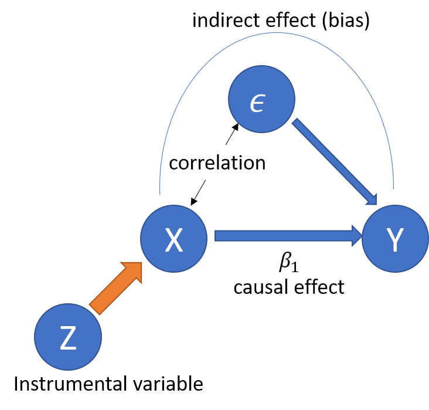

class: title-slide-section, center, middle
name: logistics
# Introduction

---
## Introduction: Endogeneity Problem and its Solution

- This chapter introduces **instrumental variable (IV, 操作変数)** method as a solution to endogeneity problem.

- The lecture plan
    1. More on endogeneity issues
    2. Framework
    3. Implementation in R

---
class: title-slide-section, center, middle
name: logistics
# Endogeneity

---
## More Examples of Endogeneity Problem 

- Talk more on endogeneity problems. 
    1. Omitted variable bias
    2. Measurement error
    3. Simultaneity

---
## Example 1: More on Omitted Variable Bias 

- Remember the wage regression equation (true model)
\begin{eqnarray}
\log W_{i}	&=&  & \beta_{0}+\beta_{1}S_{i}+\beta_{2}A_{i}+u_{i} \\
E[u_{i}|S_{i},A_{i}]	&=& & 0
\end{eqnarray}
where $W_{i}$ is wage, $S_{i}$ is the years of schooling, and $A_{i}$ is the ability. 

- Suppose that you omit $A_i$ and run the following regression instead. 
\begin{eqnarray}
\log W_{i} = alpha_{0}+\alpha_{1} S_{i} + v_i
\end{eqnarray}
Notice that $v_i = \beta_2 A_i + u_i$, so that $S_i$ and $v_i$ is likely to be correlated. 

---

## Does addition control variables solve OVB?

- You might want to add more and more additional variables to capture the effect of ability.
    - Test scores, GPA, SAT scores, etc...

- However, how many variables should we conditioning so that $S_i$ is indeed exogenous?

- Multivariate regression is valid under **selection on observables**.

- If there exists **unobserved heterogeneity** that matters both in wage and years of schooling, multivariate regression cannot deal with OVB.

---
## Example 2: Measurement error 

- Reporting error, wrong understanding of the question, etc...

- Consider the regression
$$y_{i}=\beta_{0}+\beta_{1}x_{i}^{*}+\epsilon_{i}$$
- Here, we only observe $x_{i}$ with error: 
$$x_{i}=x_{i}^{*}+e_{i}$$
    - $e_{i}$ is independent from $\epsilon_i$ and $x_i^*$ (called classical measurement error)
    - You can think $e_i$ as a noise added to the data.

---

- The regression equation is 

\begin{eqnarray}
y_{i} &=& \  \beta_{0}+\beta_{1}(x_{i}-e_{i})+\epsilon_{i} \\
	&=& \ \beta_{0}+\beta_{1}x_{i}+(\epsilon_{i}-\beta_{1}e_{i})
\end{eqnarray}

- Then we have correlation between $x_{i}$ and the error $\epsilon_{i}-\beta_{1}e_{i}$, violating the mean independence assumption.

- Measurement error in explantory variables leads to smaller estimates, known as **attenuation bias**.

---
## Example 3: Simultaneity (同時性) or reverse causality

- **Dependent and explanatory variable are determined simultaneously.**

- Consider the demand and supply curve

\begin{eqnarray}
q^{d}	=\beta_{0}^{d}+\beta_{1}^{d}p+\beta_{2}^{d}x+u^{d} \\
q^{s}	=\beta_{0}^{s}+\beta_{1}^{s}p+\beta_{2}^{s}z+u^{s}
\end{eqnarray}

- The equilibrium price and quantity are determined by $q^{d}=q^{s}$.

---

- In this case, 
$$p=\frac{(\beta_{2}^{s}z-\beta_{2}^{d}z)+(\beta_{0}^{s}-\beta_{0}^{d})+(u^{s}-u^{d})}{\beta_{1}^{d}-\beta_{1}^{s}}$$ 
implying the correlation between the price and the error term. 

- Putting this differently, the data points we observed is the intersection of these supply and demand curves. 

---

- How can we distinguish demand and supply?

---
## Causal Effect of Price on Quantity? 

- What is a causal effect of price on quantity? What is the sign (if it exists)?

- For consumer: Higher prices leads to lower demand.

- For (price-taking) firms: Higher prices leads to more supply.

- "Causal effect of price on quantity" is a meaningless concept unless you specify either demand or supply. 

---
class: title-slide-section, center, middle
name: logistics
# IV Idea

---
## Idea of IV Regression

- Let's start with a simple case. 
$$y_i = \beta_0 + \beta_1 x_i + \epsilon_i,  Cov(x_i, \epsilon_i) \neq 0$$
- Define the variable $z_i$ named **instrumental variable (IV)** that satisfies the following conditions:
    1. **Independence (独立性)**: $Cov(z_i, \epsilon_i) = 0$. No correlation between IV and error.
    2. **Relevance (関連性)**: $Cov(z_i, x_i) \neq 0$. Correlation between IV and endogenous variable $x_i$.

- Idea: Use the variation of $x_i$ **induced by instrument $z_i$** to estimate the direct (causal) effect of $x_i$ on $y_i$, that is $\beta_1$!.

---

## More on Idea

1. Intuitively, the OLS estimator captures the correlation between $x$ and $y$. 
2. If there is no correlation between $x$ and $\epsilon$, it captures the causal effect $\beta_1$. 
3. If not, the OLS estimator captures both direct and indirect effect, the latter of which is bias.
4. Now, let's capture the variation of $x$ due to instrument $z$, 
  - Such a variation should exist under **relevance** assumption.
  - Such a variation should not be correlated with the error under **independence assumption**
5. By looking at the correlation between such variation and $y$, you can get the causal effect $\beta_1$.

---

.middle[
.center[

]
]

---
## Identification of Parameter with IV

- Taking the covariance between $y_i$ and $z_i$
$$
Cov(y_i, z_i) = \beta_1 Cov(x_i, z_i) + Cov(\epsilon_i, z_i )
$$
- IV conditions implie that 
$$
\beta_1 = \frac{Cov(y_i, z_i)}{Cov(x_i, z_i)}
$$

- Question: Can you see the roles of IV conditions?

---
class: title-slide-section, center, middle
name: logistics
# IV General Framework

---
## Multiple endogenous variables and instruments

- Consider the model 
\begin{eqnarray}
  Y_i = \beta_0 + \beta_1 X_{1i} + \dots + \beta_K X_{Ki} + \beta_{K+1} W_{1i} + \dots + \beta_{K+R} W_{Ri} + u_i, 
\end{eqnarray}
  - $Y_i$ is the dependent variable
  - $X_{1i},\dots,X_{Ki}$ are $K$ endogenous (内生) regressors: $Cov(X_{ki}, u_i) \neq 0$ for all $k$. 
  - $W_{1i},\dots,W_{Ri}$ are $R$ exogenous (外生) regressors which are uncorrelated with $u_i$.  $Cov(W_{ri}, u_i) = 0$ for all $r$. 
  - $u_i$ is the error term
  - $Z_{1i},\dots,Z_{Mi}$ are $M$ instrumental variables
  - $\beta_0,\dots,\beta_{K+R}$ are $1+K+R$ unknown regression coefficients

---
## Two Stage Least Squares (2SLS, 二段階最小二乗法)

- Step 1: **First-stage regression(s)** 
    - For each of the endogenous variables ( $X_{1i},\dots,X_{ki}$ ), run an OLS regression on all IVs ( $Z_{1i},\dots,Z_{mi}$ ), all exogenous variables ( $W_{1i},\dots,W_{ri}$ ) and an intercept. 
    - Compute the fitted values ( $\widehat{X}_{1i},\dots,\widehat{X}_{ki}$ ). 

- Step 2: **Second-stage regression** 
    - Regress the dependent variable $Y_i$ on **the predicted values** of all endogenous regressors ( $\widehat{X}_{1i},\dots,\widehat{X}_{ki}$ ), all exogenous variables ( $W_{1i},\dots,W_{ri}$) and an intercept using OLS. 
    - This gives $\widehat{\beta}_{0}^{TSLS},\dots,\widehat{\beta}_{k+r}^{TSLS}$, the 2SLS estimates of the model coefficients.

---
## Why 2SLS works
- Consider a simple case with 1 endogenous variable and 1 IV. 

- In the first stage, we estimate  
$$x_i = \pi_0 + \pi_1 z_i + v_i$$
by OLS and obtain the fitted value $\widehat{x}_i = \widehat{\pi}_0 + \widehat{\pi}_1 z_i$. 

- In the second stage, we estimate
$$y_i = \beta_0 + \beta_1 \widehat{x}_i + u_i$$

- Since $\widehat{x}_i$ depends only on $z_i$, which is uncorrelated with $u_i$, the second stage can estimate $\beta_1$ without bias.

---
class: title-slide-section, center, middle
name: logistics
# Conditions for IV

---
## Conditions for Valid IVs: Necessary condition

- Depending on the number of IVs, we have three cases
    1. Over-identification (過剰識別): $M > K$
    2. Just identification (丁度識別): $M=K$
    3. Under-identification (過小識別): $M < K$

- The necessary condition is $M \geq K$.
    - We should have more IVs than endogenous variables.

---
## Sufficient condition
- In a general framework, the sufficient conditions for valid instruments
    1. **Independence**: $Cov( Z_{mi}, u_i) = 0$ for all $m$.
    2. **Relevance**: In the second stage regression, the variables 
    $$\left( \widehat{X}_{1i},\dots,\widehat{X}_{ki}, W_{1i},\dots,W_{ri}, 1 \right)$$
    are **not perfectly multicollinear**. 
    
    
- What does the relevance condition mean? 

---
## Relevance condition 

- In the simple example above, The first stage is   
$$x_i = \pi_0 + \pi_1 z_i + v_i$$
and the second stage is
$$y_i = \beta_0 + \beta_1 \widehat{x}_i + u_i$$
- The second stage would have perfect multicollinarity if $\pi_1 = 0$ (i.e., $\widehat{x}_i = \pi_0$). 

---
  
- Back to the general case, the first stage for $X_k$ can be written as 
$$X_{ki} = \pi_0 + \pi_1 Z_{1i} + \cdots + \pi_M Z_{Mi} + \pi_{M+1} W_{1i} + \cdots + \pi_{M+R} W_{Ri}$$
and one of $\pi_1 , \cdots, \pi_M$ should be non-zero. 

- Intuitively speaking, **the instruments should be correlated with endogenous variables after controlling for exogenous variables**

---
## Check Instrument Validity: Relevance

- **Weak instruments (弱操作変数)** if those instruments explain little variation in the endogenous variables. 

- Weak instruments lead to 
    1. imprecise estimates (higher standard errors)
    2. The asymptotic distribution would deviate from a normal distribution even if we have a large sample.

---

## A rule of thumb to check the relevance conditions. 

- Consider the case with one endogenous variable $X_{1i}$.
- The first stage regression  
$$X_k = \pi_0 + \pi_1 Z_{1i} + \cdots + \pi_M Z_{Mi} + \pi_{M+1} W_{1i} + \cdots + \pi_{M+R} W_{Ri}$$
- Conduct F test.
\begin{eqnarray}
H_0 & : \pi_1 = \cdots = \pi_M = 0 \\ 
H_1 & : otherwise
\end{eqnarray}

- If we can reject this, we can say no concern for weak instruments.
- A rule of thumbs is that the F statistic should be larger than 10. (Stock, Wright, and Yogo 2012)

---
## Independence (Instrument exogeneity)

- This is essentially non-testable assumption, as in mean independence assumption in OLS.

- Justification of this assumption depends on a context, institutional features, etc...
