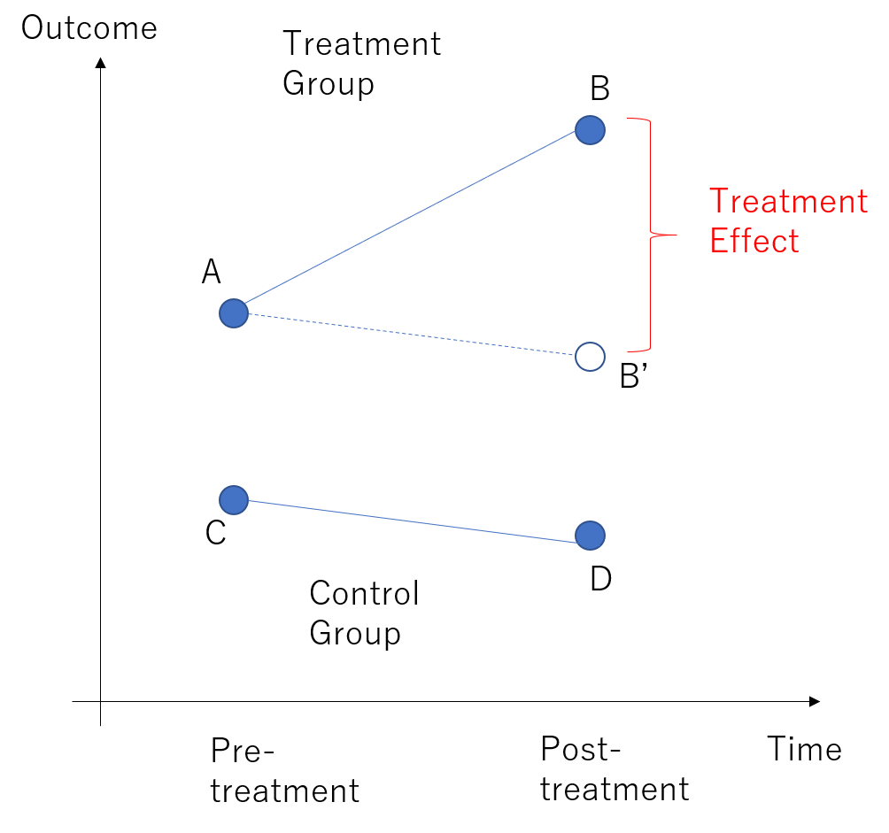
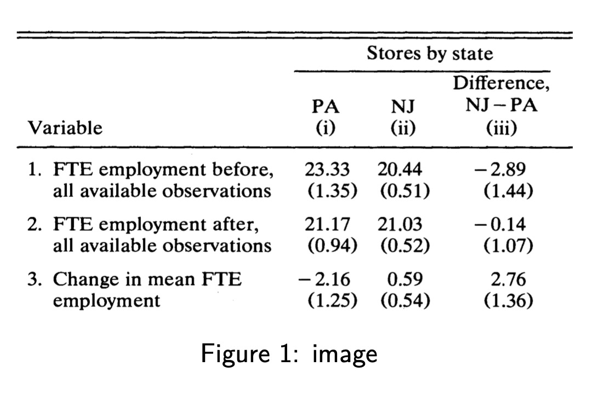
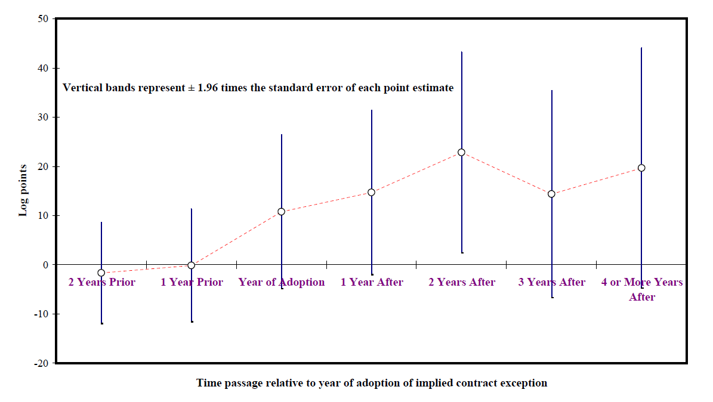
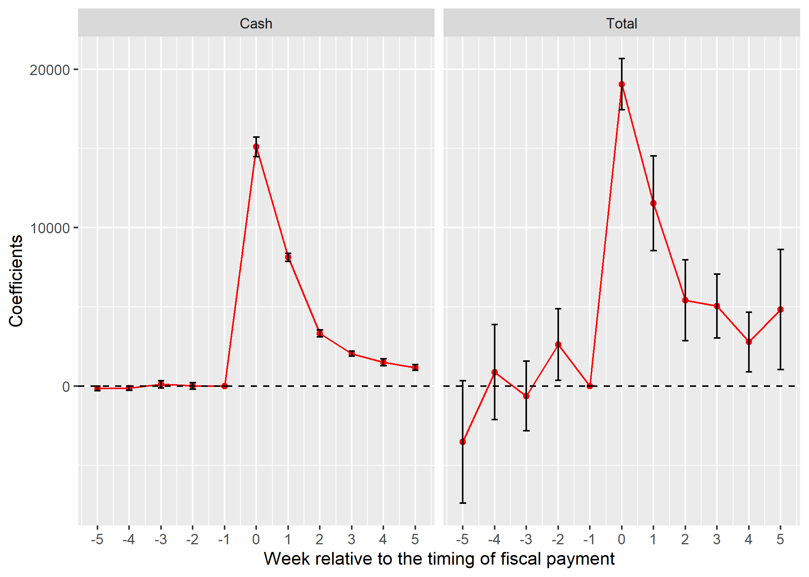
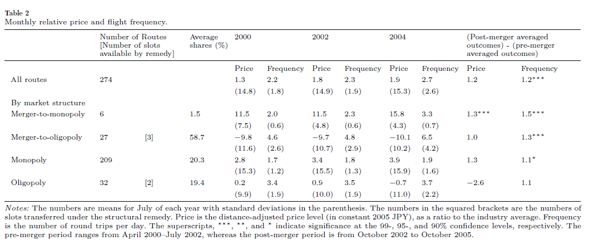
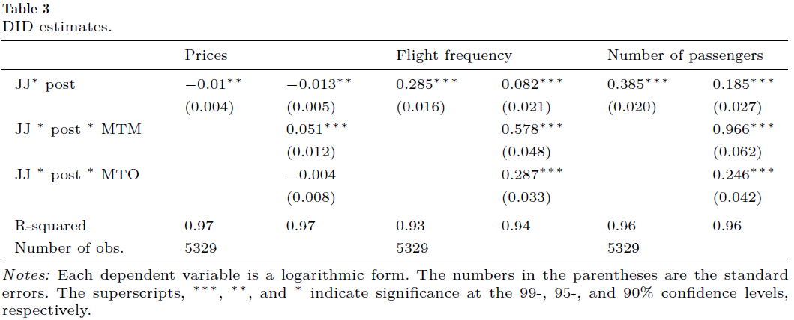

class: title-slide-section, center, middle
name: logistics
# Introduction

---
## Introduction

-   **Difference-in-differences (DID, 差の差分法)** exploits the panel structure to estimate the causal effect.

-   Two types of simple comparisons
    -   Treatment and control group comparison: selection bias
    -   Before v.s. after comparison: time trend

-   DID combines those two comparisons to draw causal conclusion.

---
## DID in Figure

.middle[
.center[

]
]

---
## Plan of the Lecture

- Framework

- Implementation in a regression framework

- Discussion on Parallel Trend Assumption

---
## Reference

-   Angrist and Pischke "Mostly Harmless Econometrics" Chapter 5

-   [Bertrand, Duflo, and Mullainathan (2004, QJE)](https://doi.org/10.1162/003355304772839588)
    -   Discuss issues of calculating standard errors in the DID method.
    
    
-   Ishise, Kitamura, Kudamatsu, Matsubayashi, and Murooka (2019) 
    - Guidance on how to conduct policy evaluation with DID 
    -   [Slide](https://slides.com/kudamatsu/did-manual/fullscreen)
    -   [Paper](https://docs.google.com/viewer?a=v&pid=sites&srcid=ZGVmYXVsdGRvbWFpbnxta3VkYW1hdHN1fGd4OjM4YzkwYmVjM2ZmMzA2YWQ)

---
class: title-slide-section, center, middle
name: logistics
# Framework

---
## Framework

-   Two periods: $t=1,2$. Treatment implemented at $t=2$.
-   $Y_{it}$: observed outcome for person $i$ in period $t$
-   $G_{i}$: dummy for treatment group
-   $D_{it}$: treatment status
    -   $D_{it}=1$ if $t=2$ and $G_{i}=1$
-   **Potential outcomes**
    -   $Y_{it}(1)$: outcome for $i$ when she is treated
    -   $Y_{it}(0)$: outcome for $i$ when she is not treated
- Then
\begin{aligned}
    Y_{it} & =D_{it}Y_{it}(1)+(1-D_{it})Y_{it}(0)
\end{aligned}

---
## Identification

-   Goal: ATT at $t=2$
    $$E[Y_{i2}(1)-Y_{i2}(0)|G_{i}=1]=E[Y_{i2}(1)|G_{i}=1]-E[Y_{i2}(0)|G_{i}=1]$$
-   What we observe
       
|        | Pre-period ( $t=1$ )    |      Post ( $t=2$ ) |
|----------------------- | ------------------------ |------------------------|
|Treatment ( $G_{i}=1$ )  | $E[Y_{i1}(0) \mid G_{i}=1]$  | $E[Y_{i2}(1)\mid G_{i}=1]$ |
|Control ( $G_{i}=0$  )   | $E[Y_{i1}(0) \mid G_{i}=0]$  | $E[Y_{i2}(0)\mid G_{i}=0]$|

- Under what assumptions can we the ATT?

---
## Simple Comparisons

- Within period comparison 
  - If $E[Y_{i2}(0)|G_{i}=1]=E[Y_{i2}(0)|G_{i}=0]$, ATT is identified by $$ATT = E[Y_{i2}(1)|G_{i}=1]-E[Y_{i2}(0)|G_{i}=0]$$
  - Selection bias?
  
  
- Before-after comparison
  - If $E[Y_{i2}(0)|G_{i}=1]=E[Y_{i1}(0)|G_{i}=1]$, ATT is identified by $$ATT = E[Y_{i2}(1)|G_{i}=1]-E[Y_{i1}(0)|G_{i}=1]$$
  - Time trend?
  
- More resonable assumption?

---
## Parallel Trend (並行トレンド) Assumption

- Assumption:
    $$E[Y_{i2}(0)-Y_{i1}(0)|G_{i}=0]=E[Y_{i2}(0)-Y_{i1}(0)|G_{i}=1]$$
    
- Interpretation: Change in the outcome *without treatment* is the same across two groups.

- This puts an assumption on **counterfactual** trend in treatment group if it had not been treated.

---
## Difference-in-differences

- Note that

\begin{aligned}
    \underbrace{E[Y_{i2}(1)-Y_{i2}(0)|G_{i}=1]}_{ATT}= & E[Y_{i2}(1)|G_{i}=1]-E[Y_{i2}(0)|G_{i}=1]\\
    = & E[Y_{i2}(1)|G_{i}=1]-E[Y_{i1}(0)|G_{i}=1]\\
     & -\underbrace{(E[Y_{i2}(0)|G_{i}=1]-E[Y_{i1}(0)|G_{i}=1])}_{=E[Y_{i2}(0)-Y_{i1}(0)|G_{i}=0]\ (pararell\ trend)}
\end{aligned}

-   Thus, 
\begin{aligned}
    ATT= & E[Y_{i2}(1)-Y_{i1}(0)|G_{i}=1]-E[Y_{i2}(0)-Y_{i1}(0)|G_{i}=0]
\end{aligned}

- ATT is identified by **the difference of two differences**

---
class: title-slide-section, center, middle
name: logistics
# Estimation

---
## Estimation Approach 1: Plug-in Estimator

-   Remember that the ATT is identified by

\begin{aligned}
    ATT= & E[Y_{i2}(1)-Y_{i1}(0)|G_{i}=1]-E[Y_{i2}(0)-Y_{i1}(0)|G_{i}=0]
\end{aligned}

-   Replace them with the sample average. 

\begin{aligned}
    \hat{ATT=} & \left\{ \bar{y}(t=2,G=1)-\bar{y}(t=1,G=1)\right\} \\
     & -\left\{ \bar{y}(t=2,G=0)-\bar{y}(t=1,G=0)\right\}
\end{aligned}

where $\bar{y}(t,G)$ is the sample average for group $G$ in period
    $t$ .

---
## Example: Card and Kruger (1994, AER)

- Question: Effects of the minimum wage increase on employment.
- On April 1, 1992, New Jersey's minimum wage rose from 4.25 to 5.05 USD.
- Compare fast-food restaurants in New Jersey (treament group) and eastern Pennsylvania (control group) before and after the rise.

---

.middle[
.center[

]
]

---
## Estimation Approach 2: Linear Regression

-   Run the following regression
    $$y_{it}=\alpha_{0}+\alpha_{1}G_{i}+\alpha_{2}T_{t}+\alpha_{3}D_{it}+\beta X_{it}+\epsilon_{it}$$
    -   $G_{i}$: dummy for treatment group
    -   $T_{t}:$dummy for treatment period
    -   $D_{it}=G_{i}\times T_{t}.$ $\alpha_{3}$ captures the ATT.

-   Regression framework can incorporate covariates $X_{it}$, which is
    important to control for observed confounding factors.

---
## Two-way Fixed Effects Estimator

-   With panel data
    $$y_{it}=\alpha D_{it}+\beta X_{it}+\epsilon_{i}+\epsilon_{t}+\epsilon_{it}$$

  - $\epsilon_{i}$ is individual FE 
  - $\epsilon_{t}$ is time FE.

-   Use the cluster-robust standard errors for inference! (Bertrand, Duflo, and Mullainathan 2004, QJE)

---
## Event Study (イベントスタディ) Specification

- With multiple periods, we can estimate **the treatment effect in the post-treatment periods**

- The specification with $k$-periods lags and leads
$$y_{it}= \epsilon_{i}+\epsilon_{t}+ \sum_{\tau = -k}^k \gamma^\tau  D_{it}^\tau + \beta X_{it} + \epsilon_{it}$$
  - $D_{it}^\tau$ takes 1 if unit $i$ is in treatment group and period $t$ is $\tau$ period far from the treatment timing.
  - Normalize $\gamma^{-1} = 0$. 
  
- Why include lags (i.e., $\tau = -k, \cdots, -1$)? See this later.

---
class: title-slide-section, center, middle
name: logistics
# Discussion on Parallel Trend Assumption

---
## Discussions on Parallel Trend

- Parallel trend assumption can be violated in various situations.

- If treatment status depends on **time-varying factors**, treatment and control group may have differential time trend in their outcome.
  - Note: DID can only deal with **time-invariant factors**.

- Example: Self-selection into treatment based on time-varying factor
  - People participate in worker training program because they expected a future decrease in earnings before they enter the program.

---
## Diagnostics for Parallel Trends: Pre-treatment trends

-   Check if the trends are parallel in the pre-treatment periods (プレトレンド)

-   Requires data on multiple pre-treatment periods.

-   Should do this if you have multiple pre-treatment periods.

-   Note: this is only **diagnostics**. NOT a direct test of the assumption!
    - Remember: Parallel trend assumption is not testable.
    - You **should never say** "the key assumption for DID is satisfied if
        the pre-treatment trends are parallel.

---
## Other Diagnostics: Placebo Effects in Pre-Treatment

-   Idea: If both groups are indeed similar, there should be **no treatment effect in the pre-treatment period.** (placebo outcome)

- We run the following event-study specification
$$y_{it}= \epsilon_{i}+\epsilon_{t}+ \sum_{\tau = -k}^k \gamma^\tau  D_{it}^\tau + \beta X_{it} + \epsilon_{it}$$
    
    
- The estimates of $\gamma^{\tau}$ should be close to zero up to the beginning of treatment 

---
## Example: Autor (2003) (from Angrist and Pischke MHE)

- Figure 5.2.4: Estimated impact of state courtsí adoption of an implied-contract exception to the employmentat-
will doctrine on use of temporary workers (from Autor 2003). The dependent variable is the log of state
temporary help employment in 1979 - 1995. Estimates are from a model that allows for e§ects before, during,
and after adoption.

.middle[
.center[

]
]

---
## Example: Kubota, Onishi, and Toyama (2021)

- To estimate the effect of receiving the SCP (特別定額給付金) on consumption, we run $$y_{itw} = \alpha_i + \alpha_{iw} + \alpha_{tpw} + \sum_{k=-5}^5 \gamma^k D_{itw}^k + u_{itw}$$
  - Household $i$ in week $w$ in year $t (=2019, 2020)$.
  - $D_{itw}^k = \mathbb{1} \{ T_i - w = k\}$, $T_i$ is the timing of receiving the SCP (i.e., treatment)
  - $y_{itw}$: consumption measure (total withdrawal, ATM withdrawal)

---

.middle[
.center[

]
]

---
# Application

---
## Application: JAL-JAS Merger (Doi and Ohashi 2019)

- Question: What is the effects of JAL-JAS merger on market outcome in airline industry.

- They use both DID and structural estimation (構造推定) approach to answer the question.

- Here, I only discuss their DID analysis.

---
## Background of JAL-JASmerger

- Around 2000, JAL and JAS tried to create a holding company (持株会社) to merge.
  - Market share: JAL 25%, JAS 24%, ANA 48%

- The JFTC (公正取引委員会) issued an interim report in March 2002 and claimed that it was likely to be **a substantial restraint of competition in the domestic air passenger market**.

- The merging party proposed remedial measures.
  - Set the pre-merger price level as the price ceiling for the post-merger period.
  - Release 9 slots at the most congested airport, and be assigned to new entrants.

- The JFTC approved the merger with the remedies and it was consummated on Oct 2002.

---
## Theoretical Effects of a Merger

- **Anticompetitive effect (反競争効果)**: The market becomes more concentrated, less competition, higher price, lower welfare.

- **Efficiency effect (効率性効果)**: The merged party may become more efficient through scale effect, synergy, knowledge transfer, etc.

- These two have different implications on economic welfare (Williamson's tradeoff)

- The JFTC (公取委) reviews the merge case and decides whether approve it.

---
## Descriptive Statistics

.middle[
.center[

]
]

---
## DID Analysis

- Outcome: Price, flight frequency, # of domestic passengers
- 274 routes in 2000–2005
- Regression equation
$$
\begin{equation}
\ln\left(y_{jmt}\right)=\gamma_{1}^{A}\cdot JJ_{jmt}+\gamma_{2}^{A}\cdot post_{t}+\gamma_{3}^{A}\cdot JJ_{jmt}\cdot post_{t}+\mathbf{x}_{jmt}^{\prime}\cdot\lambda^{A}+\kappa_{jmt}^{A}
\end{equation}
$$
  - $j$: firm, $m$: market (route), $t$: time (monthly)
  - $post_{t}=1$ if $t$ is after October 2002.
  - $JJ_{jmt}=1$ if a firm j in market m is either JAL or JAS (JAL group).
  - $\mathbf{x}_{jmt}^{\prime}$: covariates.
- Control group: Non-merged domestic airlines (ANA and others)
  - Either in the same market as JAL–JAL or in a market without JAL-JAS.

---

- Allow heterogeneous effects of a merger
$$
\begin{aligned}
\ln\left(y_{jmt}\right)= & \gamma_{1}^{B}\cdot JJ_{jmt}+\gamma_{2}^{B}\cdot post_{t}+\gamma_{3}^{B}\cdot JJ_{jmt}\cdot post_{t}\\
 & +MtM_{jmt}\cdot\left(\gamma_{4}^{B}\cdot JJ_{jmt}+\gamma_{5}^{B}\cdot post_{t}+\gamma_{6}^{B}\cdot JJ_{jmt}\cdot post_{t}\right)\\
 & +MtO_{jmt}\cdot\left(\gamma_{7}^{B}\cdot JJ_{jmt}+\gamma_{8}^{B}\cdot post_{t}+\gamma_{9}^{B}\cdot JJ_{jmt}\cdot post_{t}\right)\\
 & +x_{jmt}^{\prime}\cdot\lambda^{B}+\kappa_{jmt}^{B}
\end{aligned}
$$
  - $MtM_{jmt}=1$ if the route became a monopoly after the JJ merger
  - $MtO_{jmt}=1$ if it became oligopoly.

---
## Results

.middle[
.center[

]
]

---
## Robustness Check
- Pretrend: Regress the outcome on route-FE, time FE, and time FE interacted with the dummy for control routes. 

- Placebo test: Use the period b.w. April 2000 to July 2002. Consider placebo merger in July 2001 and see its effects using DID.

---
## Limitations of DID in this context

- Is the choice of control group appropriate?

- How to interpret the results?

- Further analysis using structural estimation approach.
