class: title-slide-section, center, middle
name: logistics
# Close election design

---
## Question and Estimation strategy

- Lee, D.S., Moretti, E., and M. Butler, 2004, Do Voters Affect or Elect Policies? Evidence from
the U.S. House, Quarterly Journal of Economics 119, 807-859.

- Do voters affect policy itself or do they just select politician?

- The roll-call voting record $RC_t$ of the representative in the district following the election t can be written as $$RC_t = (1-D_t)y_t + D_t x_t,$$
    - $D_t$: indicator variable for whether the Democrat won election t
    - $x_t \; (y_t)$: the policy implemented by the Democrat (the Repulican) at t

---

- Under some conditions, it can be expressed as 
\begin{eqnarray}
RC_t &=& constant + \pi_0 P_t^* + \pi_1 D_t +\epsilon_t \quad (1)
 \\
RC_{t+1} &=& constant +\pi_0 P_{t+1}^* + \pi_1 D_{t+1} +\epsilon_{t+1} \quad (2)
\end{eqnarray}
    - $P_{t}^*$: voters' underlying popularity (the electoral strength) of the Democrat. It is defined as the probability that party D will win if parties D and R are expected to choose their blis points, not moderating points.

---

- **What we try to know** is whether $\pi_0 = 0$ or $\pi_1 = 0$, or neither, meaning what affect representative's roll-call voting, in other words, politician's decision.
    - If $\pi_1 = 0$, the roll-call voting of the representative in the district does not vary regarless of who wins (called **Complete Convergence**). That is both parties choose the exactly same policy. The policy position is determined only by the voter's underlying popularity.
    
    - If $\pi_0 = 0$, the roll-call voting of the representative in the district does not affected by voters' underlying popularity (called **Complete Divergence**). This can be interpretted that voters can not affect policy, but merely elect politicians’ fixed policies.
    - If else, both parties select different policies, but voters can affect policy (called **Partial Convergence**).

---

- The problem is we cannot estimate equations (1) and (2), because we cannot observe $P_t^*$.

- This brings **two issues** to figure out in order to identify $\pi_0$ and $\pi_1$.
    1. Simple comparison of $RC_t$ between $D_t=1$ and $D_t=0$ without controlling on $P_t^*$ leads endogeneity bias, since $P_t^*$ tends to be higher among $D_t=1$. </br> $\Rightarrow$ We need to somehow control $P_t^*$ $\Rightarrow$ **RDD**
        - By focusing on close elections (when voteshares of both parties are very tight), we can compare the cases between when $D_t=1$ and $D_t=0$, fixing $P_t^*$ constant. $\Rightarrow$ Being able to identify $\pi_1$.
        
    2. Because $P_t^*$ is directly unobservable, we have to somehow find variation of $P_t^*$ to identify $\pi_0$. </br> $\Rightarrow$ **Incumbency advantage**
        - The random assignment of who wins in the first election generates random assignment in which candidate has greater electoral strength for the next election.</br> $\Rightarrow$ This requires **two period analysis.**

---
### Identification

- The conditional expectation of equation (2) is:
\begin{eqnarray}
\lim_{v \downarrow 0.5} E[RC_{t+1}|V_t = v] &= constant +\pi_0 E[P_{t+1}^*|D_t = 1, V_t =0.5] \\ 　&+ \pi_1 E[D_{t+1}|D_t = 1 , V_t =0.5] \\
&= constant +\pi_0 P_{t+1}^{*D} + \pi_1 P^D_{t+1} 
\end{eqnarray}
\begin{eqnarray}
\lim_{v \uparrow 0.5} E[RC_{t+1}|V_t = v] &= constant +\pi_0 E[P_{t+1}^*|D_t = 0, V_t =0.5] \\ 　&+ \pi_1 E[D_{t+1}|D_t = 0 , V_t =0.5] \\
&= constant +\pi_0 P_{t+1}^{*R} + \pi_1 P^R_{t+1} 
\end{eqnarray}
    - $V_t$ is voteshare of the Democrat in election t, and threshold is 0.5.
    - $P_{t+1}^{*D} \equiv E[P_{t+1}^*|D_t = 1, V_t =0.5],$ $P_{t+1}^{*R} \equiv E[P_{t+1}^*|D_t = 0, V_t = 0.5]$
    - $P^D_{t+1}$ ( $P^R_{t+1}$) is equilibrium probability that Democrat wins in election t+1 when Democrat (Republican) won in election t.
    
---
## Estimation

- When one could randomize $D_t$ by restricting data close to the threshold, 

\begin{eqnarray}
\underbrace{E[RC_{t+1}|D_t = 1] -  E[RC_{t+1}|D_t = 0]}_{\text{Observable}} &=& \pi_0( P_{t+1}^{*D} - P_{t+1}^{*R}) + \pi_1 (P^D_{t+1} - P^R_{t+1})  \\
&\equiv& \underbrace{\gamma}_{\text{Total effect of initial win on future roll call votes}} \quad (3) \\
\underbrace{ E[RC_{t}|D_t = 1] - E[RC_{t}|D_t = 0]}_{\text{Observable}} &=& \pi_1 \quad (4)\\
\underbrace{ E[D_{t+1}|D_t = 1] -  E[D_{t+1}|D_t = 0]}_{\text{Observable}} &=& P^D_{t+1} - P^R_{t+1} \quad (5)\\
\end{eqnarray}

- Therefore, $\pi_0( P_{t+1}^{*D} - P_{t+1}^{*R})$ can be estimated by $\gamma - \pi_1 (P_{t+1}^D - P_{t+1}^R)$

---
## Data

- There are two main data sets in this project.
- The first is a measure of how liberal an official voted, broght from **ADA score** for 1946–1995. ADA varies from 0 to 100 for each representative. Higher scores correspond to a more “liberal” voting record.

- The running variable in this study is the vote share. That is the share of all votes that went to a Democrat across Congressional districts.
    - U. S. House elections are held every two years.

---

- **Panel data** (1946–1995 $\times$ all districs around the U.S.)
- Main variables
    - `score`: ADA score in Congressional session t of the representative elected at k  $(RC_{t})$
    - `democrat`: indicator whether the Democrat wins in election t  $(D_{t})$
    - `lagdemocrat`: indicator whether the Democrat wins in election t-1 $(D_{t-1})$
    - `demvoteshare`: voteshare at district k in election t  $(V_t)$ 
    - `lagdemvoteshare`: voteshare at district k in the previous election, t-1 $(V_{t-1})$
    
    
- For example, one specific row of the dataset has the voteshares and the results of the November 1992 election (period t) and the November 1990 election  (period t-1) at district k, and the ADA score of 1993–1994 Congressional session (period t).

---

class: title-slide-section, center, middle
name: logistics
# Graphical Analysis


---
## Graphical Analysis

- Results of the analysis will be seen later. Here, we learn how to implement graphical analysis first.

- **RD analyses hinge on their graphical analyses.**

- always start with visual inspection to check which model (e.g. linear or nonlinear) is plausible.

---
### Outcomes by the running variables

- First, we try to create this figure from the article.
.middle[
.center[
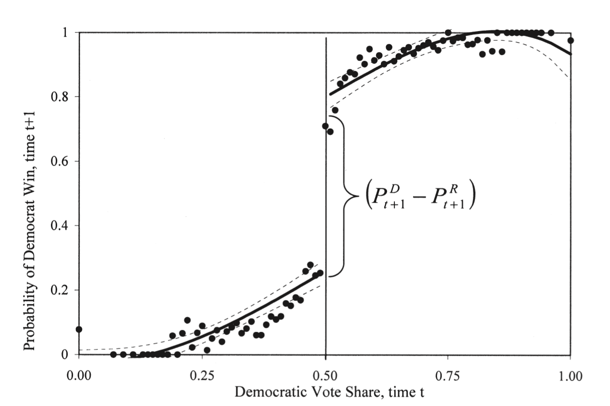
]
]
- The dependent variable is probability of Democrat victory in election t+1 and the independent is voteshare in election t.
- Then, we will see what happens when we change bandwidth and functional form.

---

```{r, message=FALSE,warning=FALSE}
library(tidyverse)
library(haven)
library(estimatr)
library(texreg)
library(latex2exp)

# Download data
read_data <- function(df)
{
  full_path <- paste("https://raw.github.com/scunning1975/mixtape/master/", 
                     df, sep = "")
  df <- read_dta(full_path)
  return(df)
}

lmb_data <- read_data("lmb-data.dta")
```
---

- First, you have more than 10,000 data points, so reduce them for scatter plot.
```{r, message=FALSE,warning=FALSE}
#aggregating the data
# calculate mean value for every 0.01 voteshare
demmeans <- split(lmb_data$democrat, cut(lmb_data$lagdemvoteshare, 100)) %>% 
  lapply(mean) %>% 
  unlist()

#createing new data frame for plotting
agg_lmb_data <- data.frame(democrat = demmeans, lagdemvoteshare = seq(0.01,1, by = 0.01))
```


---

## Quadratic fitting in all data
```{r,eval = F,warning=FALSE, fig.height=5, fig.width=7.5}
#grouping above or below threshold
lmb_data <- lmb_data %>% 
  mutate(gg_group = if_else(lagdemvoteshare > 0.5, 1,0))


#plotting
gg_srd = ggplot(data=lmb_data, aes(lagdemvoteshare, democrat)) +
    geom_point(aes(x = lagdemvoteshare, y = democrat), data = agg_lmb_data)  +
    xlim(0,1) + ylim(-0.1,1.1) +
    geom_vline(xintercept = 0.5) +
    xlab("Democrat Vote Share, time t") +
    ylab("Probability of Democrat Win, time t+1") +
    scale_y_continuous(breaks=seq(0,1,0.2)) +
    ggtitle(TeX("Effect of Initial Win on Winning Next Election: $\\P^D_{t+1} - P^R_{t+1}$")) 

gg_srd + stat_smooth(aes(lagdemvoteshare, democrat, group = gg_group), 
                     method = "lm", formula = y ~ x + I(x^2))
```

---
.middle[
.center[
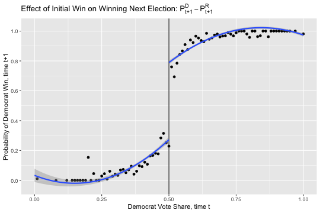
]
]

---
## Quadratic fitting; limited to +/- 0.05
```{r,eval = F,warning=FALSE, fig.height=5, fig.width=7.5}
gg_srd + stat_smooth(data=lmb_data %>% filter(lagdemvoteshare>.45 & lagdemvoteshare<.55),
                     aes(lagdemvoteshare,  democrat, group = gg_group), 
                     method = "lm", formula = y ~ x + I(x^2))
```

.middle[
.center[
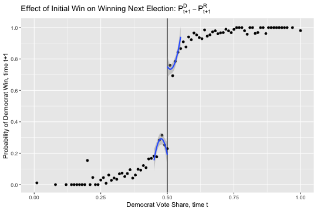
]
]

- Notice that confidence interval widens. But, lines fit plots better.

---
## Linear different slops
```{r,eval = F,warning=FALSE, fig.height=5, fig.width=7.5}
gg_srd + stat_smooth(aes(lagdemvoteshare,  democrat, group = gg_group), method = "lm") 
```

.middle[
.center[
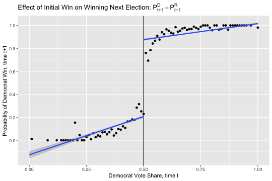
]
]
---
## Linear common slop
```{r,eval = F,warning=FALSE, fig.height=5, fig.width=7.5}
gg_srd + stat_smooth(data=lmb_data, aes(lagdemvoteshare,  democrat), 
                     method = "lm", formula = y ~ x + I(x > 0.5))
```
- Alternatively, this can avoid showing line across the threshold. 
```{r,eval = F,warning=FALSE, fig.height=5, fig.width=7.5}
lm_tmp <- lm(democrat ~ lagdemvoteshare + I(lagdemvoteshare>0.5), data = lmb_data)
lm_fun <- function(x) predict(lm_tmp, data.frame(lagdemvoteshare = x)) #output is predicted democrat
gg_srd +
stat_function(
  data = data.frame(x = c(0, 1),y = c(0, 1)),aes(x = x,y=y),
  fun = lm_fun,xlim = c(0,0.499),
  col="blue",size = 1.5) +
stat_function(
  data = data.frame(x = c(0, 1),y = c(0, 1)),aes(x = x,y=y),
  fun = lm_fun,xlim = c(0.501,1),
  col="blue", size = 1.5 )
```

---
.pull-left[
.middle[
.center[
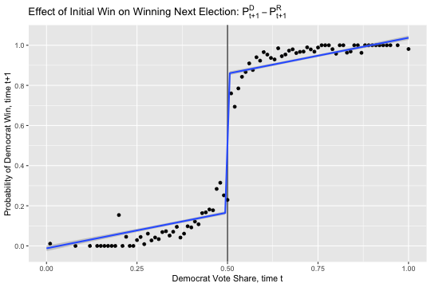
]
]
]

.pull-right[
.middle[
.center[
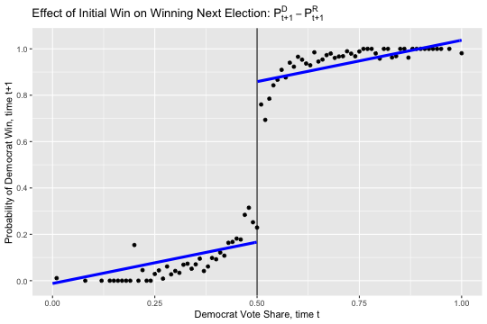
]
]
]

---
## Loess fitting
```{r,eval = F,warning=FALSE, fig.height=5, fig.width=7.5}
gg_srd + stat_smooth(aes(lagdemvoteshare, democrat, group = gg_group), method = "loess")
```

.middle[
.center[
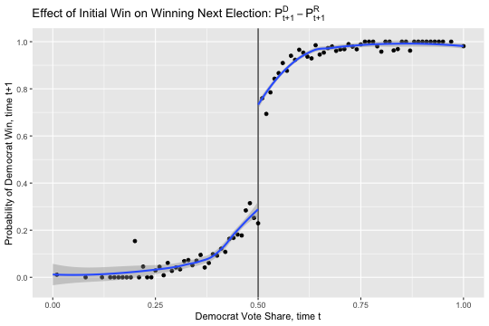
]
]
- Compared to the quadratic case, variance gets bigger but the prediction fits the points better.
---
## Kernel-weighted local polynomial regressions

```{r,eval = F,warning=FALSE, fig.height=5, fig.width=7.5}
library(stats)

smooth_dem0 <- lmb_data %>% 
  filter(lagdemvoteshare < 0.5) %>% 
  dplyr::select(democrat, lagdemvoteshare) %>% 
  na.omit()

smooth_dem0 <- as_tibble(ksmooth(smooth_dem0$lagdemvoteshare, smooth_dem0$democrat, 
                                 kernel = "box", bandwidth = 0.1))


smooth_dem1 <- lmb_data %>% 
  filter(lagdemvoteshare >= 0.5) %>% 
  dplyr::select(democrat, lagdemvoteshare) %>% 
  na.omit()
smooth_dem1 <- as_tibble(ksmooth(smooth_dem1$lagdemvoteshare, smooth_dem1$democrat, 
                                 kernel = "box", bandwidth = 0.1))

gg_srd  + 
  geom_smooth(aes(x, y), data = smooth_dem0) +
  geom_smooth(aes(x, y), data = smooth_dem1)
```

---
.middle[
.center[
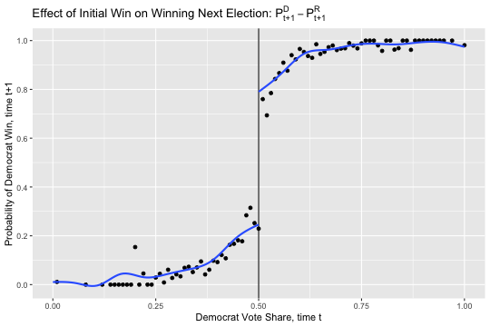
]
]

---
## Model and Bandwidth selection - bias-variance tradeoff

- How should we pick the “right” model and bandwidth?
- There’s always a **trade-off between bias and variance** when choosing bandwidth and polynomial length.
    - Bias: distance between your prediction and true value
    - Variance: width of your prediction
    - The shorter the window and the more flexible (e.g. higher-order polynomials) the model, the lower the bias, but because you have less data, the variance in your estimate increases. 

- Always, it's important to show robustness.

---

- Model selection
    - Higher-order polynomials can lead to overfitting (Gelman and Imbens 2019). They recommend using local linear regressions with linear and quadratic forms only. 
    - Local linear regression with a kernel smoother is a popular choice
- Bandwidth selection:
    - Optimal bandwidth selection: Imbens and Kalyanaraman (2011), Calonico, Cattaneo, and Titiunik (2014) **implimentation will be at the last slide**
    - Cross validation: Imbens and Lemieux (2008) 

---
class: title-slide-section, center, middle
name: logistics
# Quantitative analysis

---
## Quantitative analysis

- Our next goal is to replicate the quantitaive results of Lee, Moretti, and Butler (2004) in the table below.


|   |  $\gamma$  |    $\pi_1$ | $P_{t+1}^D - P_{t+1}^R$ |    $\pi_1(P_{t+1}^D - P_{t+1}^R)$ |    $\pi_0(P_{t+1}^{*D} - P_{t+1}^{*R})$ |
|----------------------|---------------|--------------|-------------|--------------|-------------|
|  Variable  |  $ADA_{t+1}$  |    $ADA_{t}$ | $DEM_{t+1}$ | | |
| Estimated gap  | 21.2 (1.9)  | 47.6  (1.3)| 0.48  (0.02)| | |
|   |  |  |  | 22.84 (2.2)| -1.64 (2.0) |

- The analysis restrics only observations where the Democrat voteshare is between 48 percent and 52 percent, so that the number of observations is 915.
- From the second column, complete convergence is rejected.
- The last column of the statistical insignificance shows that voters primarily elect policies rather than affect policies.
- **Complete divergence** is supported by this analysis. 


---
```{r, message=FALSE,warning=FALSE, eval=F}
# Restrict data containg the Democrat vote share between 48 percent and 52 percent
# `lagdemvoteshare` is the Dem. voteshare of the t-1 period
lmb_subset <- lmb_data %>% 
  filter(lagdemvoteshare>.48 & lagdemvoteshare<.52)

# E[ADA_{t+1}|D_t] = \gamma
lm_1 <- lm_robust(score ~ lagdemocrat, data = lmb_subset, se_type = "HC1")
# E[ADA_{t}|D_t] = \pi_1
lm_2 <- lm_robust(score ~ democrat, data = lmb_subset, se_type = "HC1")
# E[D_{t+1}|D_t] = P_{t+1}^D - P_{t+1}^R
lm_3 <- lm_robust(democrat ~ lagdemocrat, data = lmb_subset, se_type = "HC1")

screenreg(l = list(lm_1, lm_2,lm_3),
          digits = 2,
          # caption = 'title',
          custom.model.names = c("ADA_t+1", "ADA_t", "DEM_t+1"),
          include.ci = F,
          include.rsquared = FALSE, include.adjrs = FALSE, include.nobs = T, 
          include.pvalues = FALSE, include.df = FALSE, include.rmse = FALSE, 
          custom.coef.map = list("lagdemocrat"="lagdemocrat","democrat"="democrat"), 
          # select coefficients to report
          stars = numeric(0))
```

---
```{r, message=FALSE,warning=FALSE, echo=F}
# Restrict data containg the Democrat vote share between 48 percent and 52 percent
# `lagdemvoteshare` is the Dem. voteshare of the t-1 period
lmb_subset <- lmb_data %>% 
  filter(lagdemvoteshare>.48 & lagdemvoteshare<.52)

# E[ADA_{t+1}|D_t] = \gamma
lm_1 <- lm_robust(score ~ lagdemocrat, data = lmb_subset, se_type = "HC1")
# E[ADA_{t}|D_t] = \pi_1
lm_2 <- lm_robust(score ~ democrat, data = lmb_subset, se_type = "HC1")
# E[D_{t+1}|D_t] = P_{t+1}^D - P_{t+1}^R
lm_3 <- lm_robust(democrat ~ lagdemocrat, data = lmb_subset, se_type = "HC1")

screenreg(l = list(lm_1, lm_2,lm_3),
          digits = 2,
          # caption = 'title',
          custom.model.names = c("ADA_t+1", "ADA_t", "DEM_t+1"),
          include.ci = F,
          include.rsquared = FALSE, include.adjrs = FALSE, include.nobs = T, 
          include.pvalues = FALSE, include.df = FALSE, include.rmse = FALSE, 
          custom.coef.map = list("lagdemocrat"="lagdemocrat","democrat"="democrat"), 
          # select coefficients to report
          stars = numeric(0))
```

- The results are slightly different. But ignore that for now. 
- From now on, we will see how the results depend on **bandwidth** and **fanctional form**.

---
## Same specification in all the data

```{r, message=FALSE, eval=F}
#using all data (note data used is lmb_data, not lmb_subset)

lm_1 <- lm_robust(score ~ lagdemocrat, data = lmb_data, se_type = "HC1")
lm_2 <- lm_robust(score ~ democrat, data = lmb_data, se_type = "HC1")
lm_3 <- lm_robust(democrat ~ lagdemocrat, data = lmb_data, se_type = "HC1")

screenreg(l = list(lm_1, lm_2,lm_3),
          digits = 2,
          # caption = 'title',
          custom.model.names = c("ADA_t+1", "ADA_t", "DEM_t+1"),
          include.ci = F,
          include.rsquared = FALSE, include.adjrs = FALSE, include.nobs = T, 
          include.pvalues = FALSE, include.df = FALSE, include.rmse = FALSE, 
          custom.coef.map = list("lagdemocrat"="lagdemocrat","democrat"="democrat"), 
          # select coefficients to report
          stars = numeric(0))
```


---
```{r, message=FALSE, echo=F}
#using all data (note data used is lmb_data, not lmb_subset)

lm_1 <- lm_robust(score ~ lagdemocrat, data = lmb_data, se_type = "HC1")
lm_2 <- lm_robust(score ~ democrat, data = lmb_data, se_type = "HC1")
lm_3 <- lm_robust(democrat ~ lagdemocrat, data = lmb_data, se_type = "HC1")

screenreg(l = list(lm_1, lm_2,lm_3),
          digits = 2,
          # caption = 'title',
          custom.model.names = c("ADA_t+1", "ADA_t", "DEM_t+1"),
          include.ci = F,
          include.rsquared = FALSE, include.adjrs = FALSE, include.nobs = T, 
          include.pvalues = FALSE, include.df = FALSE, include.rmse = FALSE, 
          custom.coef.map = list("lagdemocrat"="lagdemocrat","democrat"="democrat"), 
          # select coefficients to report
          stars = numeric(0))
```


- Here we see that simply running the regression yields different estimates when we include data far from the cutoff itself.


---
### Controls for the running variable & Recentering of the running variable

- We will simply subtract 0.5 from the running variable.

```{r, message=FALSE, eval=FALSE}
# Recentering
lmb_data <- lmb_data %>% 
  mutate(demvoteshare_c = demvoteshare - 0.5)

lm_1 <- lm_robust(score ~ lagdemocrat + demvoteshare_c, data = lmb_data, se_type = "HC1")
lm_2 <- lm_robust(score ~ democrat + demvoteshare_c, data = lmb_data, se_type = "HC1")
lm_3 <- lm_robust(democrat ~ lagdemocrat + demvoteshare_c, data = lmb_data, se_type = "HC1")

screenreg(l = list(lm_1, lm_2,lm_3),
          digits = 2,
          # caption = 'title',
          custom.model.names = c("ADA_t+1", "ADA_t", "DEM_t+1"),
          include.ci = F,
          include.rsquared = FALSE, include.adjrs = FALSE, include.nobs = T, 
          include.pvalues = FALSE, include.df = FALSE, include.rmse = FALSE, 
          custom.coef.map = list("lagdemocrat"="lagdemocrat","democrat"="democrat"), 
          # select coefficients to report
          stars = numeric(0))
```

---
```{r, message=FALSE, echo=FALSE}
# Recentering
lmb_data <- lmb_data %>% 
  mutate(demvoteshare_c = demvoteshare - 0.5)

lm_1 <- lm_robust(score ~ lagdemocrat + demvoteshare_c, data = lmb_data, se_type = "HC1")
lm_2 <- lm_robust(score ~ democrat + demvoteshare_c, data = lmb_data, se_type = "HC1")
lm_3 <- lm_robust(democrat ~ lagdemocrat + demvoteshare_c, data = lmb_data, se_type = "HC1")

screenreg(l = list(lm_1, lm_2,lm_3),
          digits = 2,
          # caption = 'title',
          custom.model.names = c("ADA_t+1", "ADA_t", "DEM_t+1"),
          include.ci = F,
          include.rsquared = FALSE, include.adjrs = FALSE, include.nobs = T, 
          include.pvalues = FALSE, include.df = FALSE, include.rmse = FALSE, 
          custom.coef.map = list("lagdemocrat"="lagdemocrat","democrat"="democrat"), 
          # select coefficients to report
          stars = numeric(0))
```


---
## Different slopes on either side of the discontinuity

- How to impliment a regression line to be on either side, which means necessarily that we have two lines left and right of the discontinuity? $\Rightarrow$ **Interaction**

```{r, message=FALSE, eval=FALSE}
lm_1 <- lm_robust(score ~ lagdemocrat*demvoteshare_c, 
                  data = lmb_data, se_type = "HC1")
lm_2 <- lm_robust(score ~ democrat*demvoteshare_c, 
                  data = lmb_data, se_type = "HC1")
lm_3 <- lm_robust(democrat ~ lagdemocrat*demvoteshare_c, 
                  data = lmb_data, se_type = "HC1")

screenreg(l = list(lm_1, lm_2,lm_3),
          digits = 2,
          # caption = 'title',
          custom.model.names = c("ADA_t+1", "ADA_t", "DEM_t+1"),
          include.ci = F,
          include.rsquared = FALSE, include.adjrs = FALSE, include.nobs = T, 
          include.pvalues = FALSE, include.df = FALSE, include.rmse = FALSE, 
          custom.coef.map = list("lagdemocrat"="lagdemocrat","democrat"="democrat"), 
          # select coefficients to report
          stars = numeric(0))
```

---

```{r, message=FALSE, echo=FALSE}
lm_1 <- lm_robust(score ~ lagdemocrat*demvoteshare_c, 
                  data = lmb_data, se_type = "HC1")
lm_2 <- lm_robust(score ~ democrat*demvoteshare_c, 
                  data = lmb_data, se_type = "HC1")
lm_3 <- lm_robust(democrat ~ lagdemocrat*demvoteshare_c, 
                  data = lmb_data, se_type = "HC1")

screenreg(l = list(lm_1, lm_2,lm_3),
          digits = 2,
          # caption = 'title',
          custom.model.names = c("ADA_t+1", "ADA_t", "DEM_t+1"),
          include.ci = F,
          include.rsquared = FALSE, include.adjrs = FALSE, include.nobs = T, 
          include.pvalues = FALSE, include.df = FALSE, include.rmse = FALSE, 
          custom.coef.map = list("lagdemocrat"="lagdemocrat","democrat"="democrat"), 
          # select coefficients to report
          stars = numeric(0))
```

---
## Different quadratic regressions in all data


```{r, message=FALSE, eval=FALSE}
lmb_data <- lmb_data %>% 
  mutate(demvoteshare_sq = demvoteshare_c^2)

lm_1 <- lm_robust(score ~ lagdemocrat*demvoteshare_c + lagdemocrat*demvoteshare_sq, 
                  data = lmb_data, se_type = "HC1")
lm_2 <- lm_robust(score ~ democrat*demvoteshare_c + democrat*demvoteshare_sq, 
                  data = lmb_data, se_type = "HC1")
lm_3 <- lm_robust(democrat ~ lagdemocrat*demvoteshare_c + lagdemocrat*demvoteshare_sq, 
                  data = lmb_data, se_type = "HC1")


screenreg(l = list(lm_1, lm_2,lm_3),
          digits = 2,
          # caption = 'title',
          custom.model.names = c("ADA_t+1", "ADA_t", "DEM_t+1"),
          include.ci = F,
          include.rsquared = FALSE, include.adjrs = FALSE, include.nobs = T, 
          include.pvalues = FALSE, include.df = FALSE, include.rmse = FALSE, 
          custom.coef.map = list("lagdemocrat"="lagdemocrat","democrat"="democrat"), 
          # select coefficients to report
          stars = numeric(0))
```

---

```{r, message=FALSE, echo=FALSE}
lmb_data <- lmb_data %>% 
  mutate(demvoteshare_sq = demvoteshare_c^2)

lm_1 <- lm_robust(score ~ lagdemocrat*demvoteshare_c + lagdemocrat*demvoteshare_sq, 
                  data = lmb_data, se_type = "HC1")
lm_2 <- lm_robust(score ~ democrat*demvoteshare_c + democrat*demvoteshare_sq, 
                  data = lmb_data, se_type = "HC1")
lm_3 <- lm_robust(democrat ~ lagdemocrat*demvoteshare_c + lagdemocrat*demvoteshare_sq, 
                  data = lmb_data, se_type = "HC1")

screenreg(l = list(lm_1, lm_2,lm_3),
          digits = 2,
          # caption = 'title',
          custom.model.names = c("ADA_t+1", "ADA_t", "DEM_t+1"),
          include.ci = F,
          include.rsquared = FALSE, include.adjrs = FALSE, include.nobs = T, 
          include.pvalues = FALSE, include.df = FALSE, include.rmse = FALSE, 
          custom.coef.map = list("lagdemocrat"="lagdemocrat","democrat"="democrat"), 
          # select coefficients to report
          stars = numeric(0))
```


- The larger standard error due to the longer polynomial term.

---
## Different quadratic regression; limited to +/- 0.05


```{r, message=FALSE, eval=FALSE}
lmb_subset <- lmb_data %>% 
  filter(demvoteshare > .45 & demvoteshare < .55) %>% 
  mutate(demvoteshare_sq = demvoteshare_c^2)

lm_1 <- lm_robust(score ~ lagdemocrat*demvoteshare_c + lagdemocrat*demvoteshare_sq, 
                  data = lmb_subset, se_type = "HC1")
lm_2 <- lm_robust(score ~ democrat*demvoteshare_c + democrat*demvoteshare_sq, 
                  data = lmb_subset, se_type = "HC1")
lm_3 <- lm_robust(democrat ~ lagdemocrat*demvoteshare_c + lagdemocrat*demvoteshare_sq, 
                  data = lmb_subset, se_type = "HC1")

screenreg(l = list(lm_1, lm_2,lm_3),
          digits = 2,
          # caption = 'title',
          custom.model.names = c("ADA_t+1", "ADA_t", "DEM_t+1"),
          include.ci = F,
          include.rsquared = FALSE, include.adjrs = FALSE, include.nobs = T, 
          include.pvalues = FALSE, include.df = FALSE, include.rmse = FALSE, 
          custom.coef.map = list("lagdemocrat"="lagdemocrat","democrat"="democrat"), 
          # select coefficients to report
          stars = numeric(0))
```

---
```{r, message=FALSE, echo=FALSE}
lmb_subset <- lmb_data %>% 
  filter(demvoteshare > .45 & demvoteshare < .55) %>% 
  mutate(demvoteshare_sq = demvoteshare_c^2)

lm_1 <- lm_robust(score ~ lagdemocrat*demvoteshare_c + lagdemocrat*demvoteshare_sq, 
                  data = lmb_subset, se_type = "HC1")
lm_2 <- lm_robust(score ~ democrat*demvoteshare_c + democrat*demvoteshare_sq, 
                  data = lmb_subset, se_type = "HC1")
lm_3 <- lm_robust(democrat ~ lagdemocrat*demvoteshare_c + lagdemocrat*demvoteshare_sq, 
                  data = lmb_subset, se_type = "HC1")

screenreg(l = list(lm_1, lm_2,lm_3),
          digits = 2,
          # caption = 'title',
          custom.model.names = c("ADA_t+1", "ADA_t", "DEM_t+1"),
          include.ci = F,
          include.rsquared = FALSE, include.adjrs = FALSE, include.nobs = T, 
          include.pvalues = FALSE, include.df = FALSE, include.rmse = FALSE, 
          custom.coef.map = list("lagdemocrat"="lagdemocrat","democrat"="democrat"), 
          # select coefficients to report
          stars = numeric(0))
```

---
## Optimal bandwidth by `rdrobust`

- The method of optimal bandwidth selection (Calonico, Cattaneo, and Titiunik 2014) can be implemented with the user-created `rdrobust` command.

- These methods ultimately choose optimal bandwidths that may differ left and right of the cutoff based on some bias-variance trade-off. 

```{r, message=FALSE,eval=FALSE}
# install.packages("rdrobust")
library(rdrobust)

rdr <- rdrobust(y = lmb_data$score,
                x = lmb_data$demvoteshare, c = 0.5)
summary(rdr)
```

---
```{r, message=FALSE,echo=FALSE,warning=FALSE}
# install.packages("rdrobust")
library(rdrobust)

rdr <- rdrobust(y = lmb_data$score,
                x = lmb_data$demvoteshare, c = 0.5)
summary(rdr)
```


---
class: title-slide-section, center, middle
name: logistics
# Covariate test

---
## Covariates by the running variables

- We use income (`realincome`) as covariates.
- We limit window of voteshare from 0.25 to 0.75.

```{r,eval=FALSE}
#aggregating the data
lmb_subset = lmb_data %>% 
    dplyr::select(realincome,demvoteshare) %>% 
    filter(demvoteshare>.25 & demvoteshare<.75) %>% 
    na.omit()

#calculate mean value for every 0.01 voteshare
demmeans <- split(lmb_subset$realincome, cut(lmb_subset$demvoteshare, 50)) %>% 
  lapply(mean) %>% 
  unlist()

#createing new data frame for plotting
agg_lmb_data <- data.frame(income = demmeans, demvoteshare = seq(0.26, 0.75, by = 0.01))
```
---
## Covariate test for income
```{r,eval=FALSE}
#grouping above or below threshold
lmb_subset <- lmb_subset %>% 
  mutate(gg_group = if_else(demvoteshare > 0.5, 1,0))

#plotting
ggplot(data=lmb_subset, aes(demvoteshare, realincome)) +
  geom_point(aes(x = demvoteshare, y = income), data = agg_lmb_data)  +
  geom_vline(xintercept = 0.5) +
  stat_smooth( aes(demvoteshare, realincome, group = gg_group), method = "lm", formula = y ~ x + I(x^2)) + ggtitle("voteshare and income")
  

```

---


.middle[
.center[
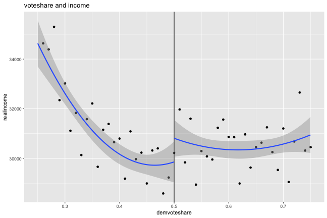
]
]

---
.middle[
.center[
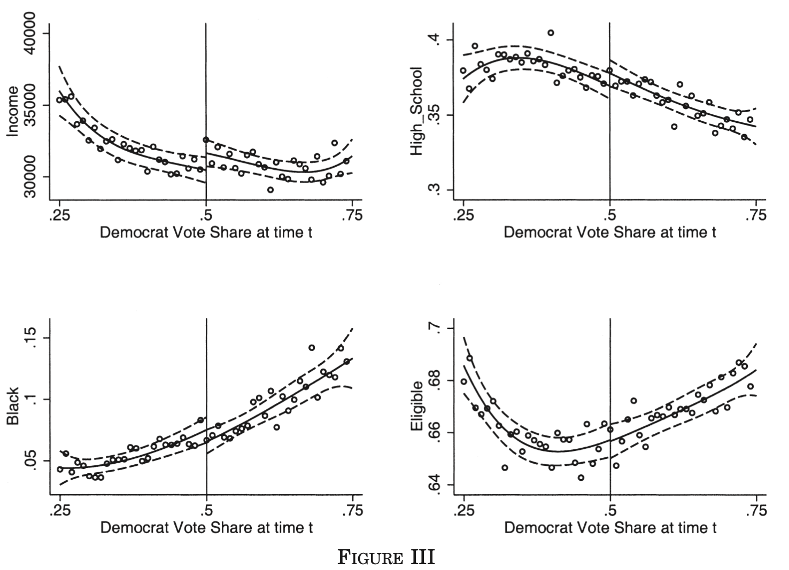
]
]


- The authors also did covariate tests with other variables such as percentage with high-school degree (`pcthighschl`), percentage black (`pctblack`), percentage eligible to vote (`votingpop/totpop`).


---

.middle[
.center[
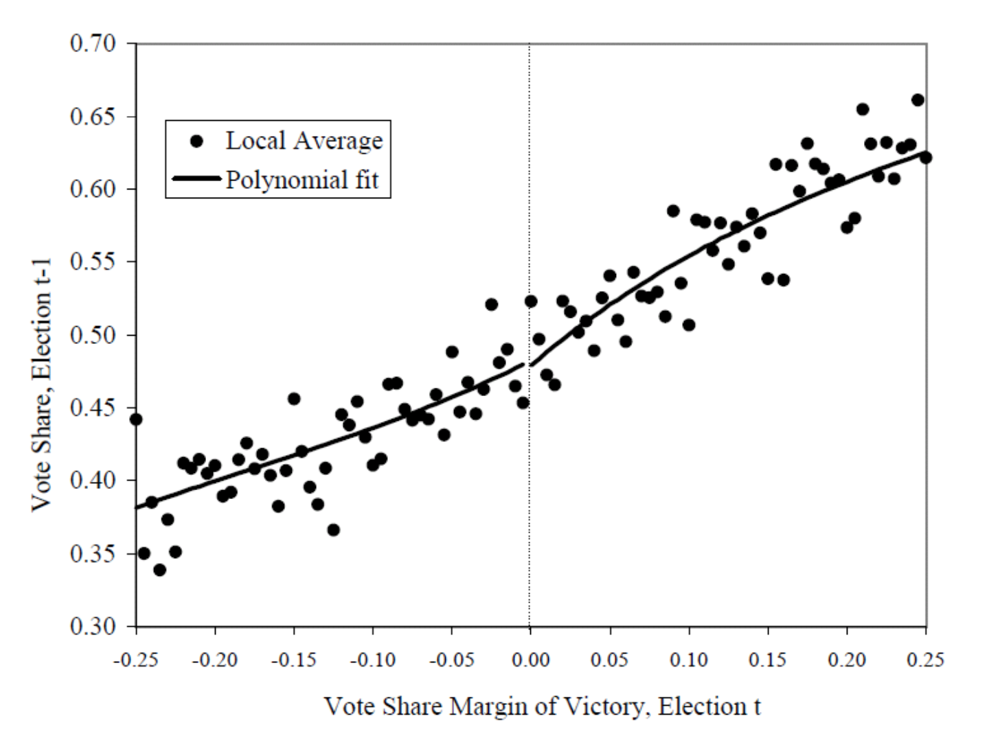
]
]

- t-1 period's outcome is also often used as a placebo.


---
### Coding of placebo
```{r,eval = F,warning=FALSE, fig.height=5, fig.width=7.5,message=FALSE,warning=FALSE}
#aggregating the data
# calculate mean value for every 0.01 voteshare
demmeans <- split(lmb_data$lagdemvoteshare, cut(lmb_data$demvoteshare, 100)) %>% 
  lapply(mean) %>% 
  unlist()
#createing new data frame for plotting
agg_lmb_data <- data.frame(lagdemvoteshare=demmeans, demvoteshare = seq(0.01,1, by = 0.01))
#grouping above or below threshold
lmb_data <- lmb_data %>% 
  mutate(gg_group = if_else(demvoteshare > 0.5, 1,0))


#plotting
ggplot(data=lmb_data, aes(demvoteshare, lagdemvoteshare)) +
    geom_point(aes(x = demvoteshare, y = lagdemvoteshare), data = agg_lmb_data)  +
    xlim(0,1) + ylim(-0.1,1.1) +
    geom_vline(xintercept = 0.5) +
    xlab("Democrat Vote Share, time t") +
    ylab("Democrat Vote Share, time t-1") +
    scale_y_continuous(breaks=seq(0,1,0.2)) +
    ggtitle(TeX("Democratic Party Vote Share in Election t-1, by Democratic Party Vote Share in Election t$")) + stat_smooth(data=lmb_data,aes(x=demvoteshare, y=lagdemvoteshare, group = gg_group), 
                     method = "lm", formula = y ~ x + I(x^2))
```
---
.middle[
.center[
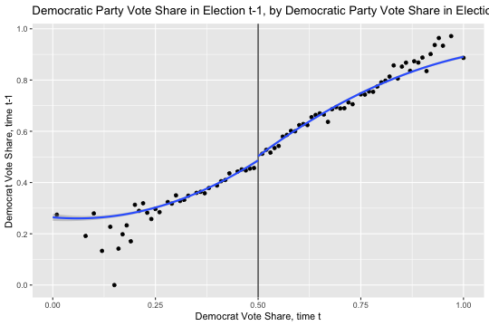
]
]

---
class: title-slide-section, center, middle
name: logistics
# Density test

---
##  Density of the running variables

-  McCrary density test
- We will implement this test using local polynomial density estimation (Cattaneo, Jansson, and Ma 2019).
```{r,eval = F,warning=FALSE, fig.height=6, fig.width=9}
# install.packages("rddensity")
# install.packages("rdd")
library(rddensity)
library(rdd)

DCdensity(lmb_data$demvoteshare, cutpoint = 0.5)

density <- rddensity(lmb_data$demvoteshare, c = 0.5)
rdplotdensity(density, lmb_data$demvoteshare)
```
---
.pull-left[
.middle[
.center[
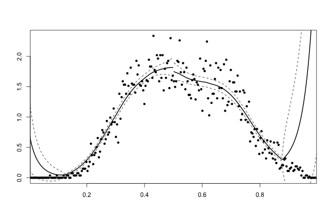
]
]
]

.pull-right[
.middle[
.center[
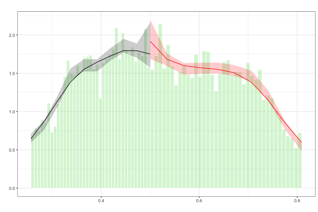
]
]
]
- No signs that there was manipulation in the running variable at the cutoff.
